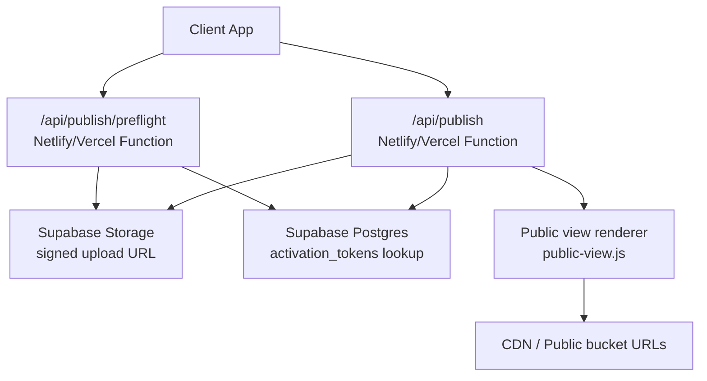
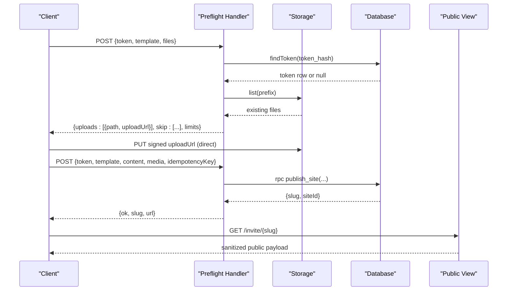
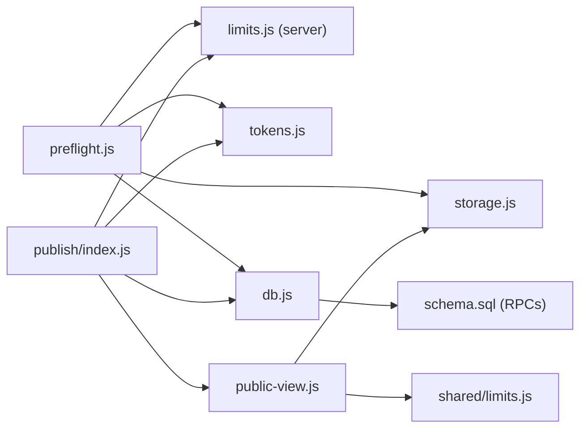

# Publishing & Deployment Pipeline

<cite>
**Referenced Files in This Document**
- [api/publish/index.js](file://api/publish/index.js)
- [api/publish/preflight.js](file://api/publish/preflight.js)
- [api/_lib/auth.js](file://api/_lib/auth.js)
- [api/_lib/tokens.js](file://api/_lib/tokens.js)
- [api/_lib/limits.js](file://api/_lib/limits.js)
- [shared/limits.js](file://shared/limits.js)
- [api/_lib/storage.js](file://api/_lib/storage.js)
- [api/_lib/public-view.js](file://api/_lib/public-view.js)
- [api/_lib/db.js](file://api/_lib/db.js)
- [supabase/schema.sql](file://supabase/schema.sql)
- [netlify/functions/publish.js](file://netlify/functions/publish.js)
- [netlify/functions/publish-preflight.js](file://netlify/functions/publish-preflight.js)
- [netlify.toml](file://netlify.toml)
- [vercel.json](file://vercel.json)
</cite>

## Table of Contents
1. Introduction
2. Project Structure
3. Core Components
4. Architecture Overview
5. Detailed Component Analysis
6. Dependency Analysis
7. Performance Considerations
8. Troubleshooting Guide
9. Conclusion

## Introduction
This document explains the end-to-end publishing pipeline that transforms edited invitations into shareable wedding websites. It covers token-based activation, preflight checks, content and asset validation, storage uploads, database transactions, public rendering, and deployment routing on both Netlify and Vercel. Security measures such as token hashing with a pepper, signed upload URLs, rate limiting, and strict content sanitization are detailed. Practical workflow examples, error handling strategies, and production monitoring approaches are included to help operators run this system reliably.

## Project Structure
The publishing pipeline is implemented as serverless functions backed by Supabase (Postgres + Storage). The key directories:
- api/: business logic for publishing, preflight, admin auth, and shared utilities
- netlify/functions/: thin wrappers that bridge platform functions to the API handlers
- supabase/schema.sql: database schema and stored procedures that enforce one-token-one-site semantics
- shared/limits.js: shared limits used by both browser and server
- Configuration files: netlify.toml and vercel.json define routes, caching, and scheduled jobs

**Diagram sources**
- [netlify/functions/publish.js:1-7](file://netlify/functions/publish.js#L1-L7)
- [netlify/functions/publish-preflight.js:1-8](file://netlify/functions/publish-preflight.js#L1-L8)
- [api/publish/preflight.js:1-136](file://api/publish/preflight.js#L1-L136)
- [api/publish/index.js:1-135](file://api/publish/index.js#L1-L135)
- [api/_lib/storage.js:1-183](file://api/_lib/storage.js#L1-L183)
- [api/_lib/db.js:1-265](file://api/_lib/db.js#L1-L265)
- [api/_lib/public-view.js:1-335](file://api/_lib/public-view.js#L1-L335)

**Section sources**
- [netlify.toml:1-121](file://netlify.toml#L1-L121)
- [vercel.json:1-60](file://vercel.json#L1-L60)

## Core Components
- Token management: generation, normalization, hashing with pepper, draft folder derivation, and public slug creation
- Preflight endpoint: validates token shape and template, lists existing uploads, and returns short-lived signed upload URLs
- Publish endpoint: validates content and media references, consumes the token atomically, creates the site row, and returns the invite URL
- Storage abstraction: signs direct uploads, builds public URLs, moves/promotes assets, and supports backups
- Public view renderer: allow-lists fields per template, sanitizes colors and URLs, resolves media to CDN URLs, and constructs safe public payloads
- Database layer: thin wrapper around PostgREST, transactional RPCs for publish/update/rollback/versioning
- Admin authentication: HMAC-signed session cookie with expiration and secure flags
- Limits: shared caps for photos, content size, rates, and TTLs

**Section sources**
- [api/_lib/tokens.js:1-155](file://api/_lib/tokens.js#L1-L155)
- [api/publish/preflight.js:1-136](file://api/publish/preflight.js#L1-L136)
- [api/publish/index.js:1-135](file://api/publish/index.js#L1-L135)
- [api/_lib/storage.js:1-183](file://api/_lib/storage.js#L1-L183)
- [api/_lib/public-view.js:1-335](file://api/_lib/public-view.js#L1-L335)
- [api/_lib/db.js:1-265](file://api/_lib/db.js#L1-L265)
- [api/_lib/auth.js:1-124](file://api/_lib/auth.js#L1-L124)
- [shared/limits.js:1-84](file://shared/limits.js#L1-L84)

## Architecture Overview
The pipeline enforces a strict separation between client-side preparation and server-side validation:
- Preflight runs first: it validates the token and template, computes a deterministic draft folder from the token hash, lists any already-uploaded assets, and issues time-limited signed upload URLs. No token is consumed here.
- Direct upload: the client uploads images directly to storage using the signed URL; no image bytes traverse the function runtime.
- Publish: after uploads complete, the client calls publish with text content and media paths. The server validates content and media references against allowed prefixes derived from the token hash, then invokes a database RPC that atomically claims the token, creates the site, records versions, and ensures idempotency.
- Public view: guests load the invitation via a slug; the server fetches the site row and renders a sanitized public payload using an allow-list per template.

**Diagram sources**
- [api/publish/preflight.js:1-136](file://api/publish/preflight.js#L1-L136)
- [api/publish/index.js:1-135](file://api/publish/index.js#L1-L135)
- [api/_lib/storage.js:1-183](file://api/_lib/storage.js#L1-L183)
- [api/_lib/db.js:1-265](file://api/_lib/db.js#L1-L265)
- [api/_lib/public-view.js:1-335](file://api/_lib/public-view.js#L1-L335)

## Detailed Component Analysis

### Token-Based Authentication and Activation
- Tokens are generated with a constrained alphabet and grouped format for human readability. They are normalized to handle common typos and confusable characters.
- Tokens are never stored in plaintext; only sha256(token || pepper) is persisted. A missing or invalid pepper causes an upstream error.
- Draft folders are derived deterministically from the token hash so uploads are isolated per customer and stable across retries.
- Public slugs are built from couple names plus a random suffix, containing no secrets or IDs.

Security notes:
- Token hashing uses a server-side pepper environment variable.
- Only the database stores token hashes; plain tokens exist only in user communications.
- Slug validation restricts characters and length to prevent injection and enumeration attacks.

**Section sources**
- [api/_lib/tokens.js:1-155](file://api/_lib/tokens.js#L1-L155)
- [shared/limits.js:1-84](file://shared/limits.js#L1-L84)

### Preflight Checks and Asset Processing
- Validates token shape and template before querying the database.
- Looks up the token row to ensure it exists, is not revoked, and matches the requested template.
- Computes a draft prefix from the token hash and lists existing files to avoid re-uploads.
- Returns signed upload URLs scoped to exact paths with a short TTL. Paths are server-generated and validated against a safe path pattern.
- Enforces file descriptor limits: type, dimensions, per-photo size, total media size, and distinct photo count.

Error handling:
- Unknown, revoked, or wrong-template tokens return explicit codes without logging sensitive data.
- Listing failures are non-fatal; clients may retry uploads.

**Section sources**
- [api/publish/preflight.js:1-136](file://api/publish/preflight.js#L1-L136)
- [api/_lib/limits.js:1-188](file://api/_lib/limits.js#L1-L188)
- [api/_lib/storage.js:1-183](file://api/_lib/storage.js#L1-L183)

### Publish Endpoint and Database Transaction
- Reads and validates JSON body within a small size limit.
- Validates template, idempotency key, content shape and size, and optional wedding date.
- Derives media paths from the token’s draft prefix to prevent cross-customer path injection.
- Attempts to publish with slug generation based on couple names; retries up to three times on slug collisions.
- Calls a database RPC that:
  - Checks idempotency key to avoid duplicate sites
  - Claims the token atomically (status issued -> consumed)
  - Creates the site row with content and media
  - Records a version snapshot
  - Links the token to the site
- Returns the invite URL constructed from the slug.

Failure modes:
- TOKEN_NOT_AVAILABLE: unknown, revoked, wrong template, or already consumed
- SLUG_TAKEN: transient collision; handled by retrying with a new suffix
- SERVER: unexpected errors

Idempotency:
- The idempotency key prevents double-publishing on retries or network blips.

**Section sources**
- [api/publish/index.js:1-135](file://api/publish/index.js#L1-L135)
- [api/_lib/db.js:1-265](file://api/_lib/db.js#L1-L265)
- [supabase/schema.sql:136-208](file://supabase/schema.sql#L136-L208)

### Public Rendering and Content Sanitization
- The public view module is an allow-list per template. Only explicitly whitelisted fields are emitted, preventing accidental leakage of private columns.
- Text fields are clamped to a maximum length.
- Colors must match a hex pattern to prevent stylesheet injection.
- URLs are restricted to https to avoid mixed content and javascript/data URIs.
- Media references are either local markers (@m<n>) or bundled asset paths; arbitrary external URLs are rejected.
- Media arrays are resolved to CDN URLs with responsive sizes and srcset attributes. Width and height are included to reduce layout shifts.

Template awareness:
- Names and dates are extracted consistently for slug generation and preview metadata regardless of template structure.

**Section sources**
- [api/_lib/public-view.js:1-335](file://api/_lib/public-view.js#L1-L335)

### Admin Authentication
- Admin login sets an HttpOnly, Secure, SameSite=Strict cookie scoped to /api.
- Session payload is signed with HMAC over subject and expiry; verification is constant-time.
- requireAdmin guard returns 401 if the session is missing or expired.

Operational note:
- Password comparison is done server-side and never logged.

**Section sources**
- [api/_lib/auth.js:1-124](file://api/_lib/auth.js#L1-L124)

### Deployment and Routing
- Netlify:
  - Functions directory maps to API handlers via a bridge.
  - Routes rewrite /api/* and /invite/* to functions while keeping the address bar intact.
  - Scheduled keepalive runs nightly to keep the project warm.
  - Global security headers applied at the platform level.
- Vercel:
  - Rewrites /invite/:slug to the invite handler.
  - Caching headers set for HTML, assets, and admin pages.
  - Cron schedule defined for keepalive.

Both platforms rely on the same API code; only the function wrapper differs.

**Section sources**
- [netlify.toml:1-121](file://netlify.toml#L1-L121)
- [vercel.json:1-60](file://vercel.json#L1-L60)
- [netlify/functions/publish.js:1-7](file://netlify/functions/publish.js#L1-L7)
- [netlify/functions/publish-preflight.js:1-8](file://netlify/functions/publish-preflight.js#L1-L8)

## Dependency Analysis
The following diagram shows how components depend on each other during publishing and viewing.

**Diagram sources**
- [api/publish/preflight.js:1-136](file://api/publish/preflight.js#L1-L136)
- [api/publish/index.js:1-135](file://api/publish/index.js#L1-L135)
- [api/_lib/limits.js:1-188](file://api/_lib/limits.js#L1-L188)
- [shared/limits.js:1-84](file://shared/limits.js#L1-L84)
- [api/_lib/tokens.js:1-155](file://api/_lib/tokens.js#L1-L155)
- [api/_lib/storage.js:1-183](file://api/_lib/storage.js#L1-L183)
- [api/_lib/public-view.js:1-335](file://api/_lib/public-view.js#L1-L335)
- [api/_lib/db.js:1-265](file://api/_lib/db.js#L1-L265)
- [supabase/schema.sql:136-208](file://supabase/schema.sql#L136-L208)

**Section sources**
- [api/publish/preflight.js:1-136](file://api/publish/preflight.js#L1-L136)
- [api/publish/index.js:1-135](file://api/publish/index.js#L1-L135)
- [api/_lib/public-view.js:1-335](file://api/_lib/public-view.js#L1-L335)
- [api/_lib/db.js:1-265](file://api/_lib/db.js#L1-L265)
- [supabase/schema.sql:136-208](file://supabase/schema.sql#L136-L208)

## Performance Considerations
- Direct uploads bypass function payload and duration limits by issuing signed URLs to storage.
- Preflight lists existing files to skip re-uploads, reducing bandwidth and latency.
- Responsive image sizes minimize egress costs and improve perceived performance on mobile networks.
- Database RPCs are wrapped with timeouts to avoid hanging serverless invocations.
- Rate limits protect endpoints from abuse and resource exhaustion.
- Public responses use minimal payloads and rely on CDN caching for assets.

[No sources needed since this section provides general guidance]

## Troubleshooting Guide
Common errors and their meanings:
- TOKEN_INVALID: malformed token or not found; check input normalization and environment pepper configuration
- TOKEN_REVOKED: token was revoked by admin; regenerate a new token
- TOKEN_WRONG_TEMPLATE: token template does not match the requested template
- TOKEN_USED: token already consumed; recover link if available
- TOO_LARGE / CONTENT_TOO_LARGE / MEDIA_TOTAL_TOO_LARGE: exceed size limits; compress images or reduce content
- FILE_TYPE / FILE_DIMENSIONS / FILE_VARIANT: unsupported image type, oversized dimensions, or invalid variant
- MEDIA_PATH_OUTSIDE_DRAFT: media reference not under the expected draft prefix; ensure paths come from preflight
- RATE_LIMITED: too many requests; back off and retry
- UPSTREAM: storage or database unreachable; check environment variables and service health
- SLUG_TAKEN: transient collision; the publish endpoint retries automatically

Monitoring recommendations:
- Log preflight outcomes including counts of uploads and skipped files
- Log publish successes and refusal reasons with template and slug context
- Track storage reachability and error statuses
- Monitor database reachability and RPC error messages
- Use scheduled keepalive to prevent cold starts and project pauses

**Section sources**
- [api/publish/preflight.js:1-136](file://api/publish/preflight.js#L1-L136)
- [api/publish/index.js:1-135](file://api/publish/index.js#L1-L135)
- [api/_lib/storage.js:1-183](file://api/_lib/storage.js#L1-L183)
- [api/_lib/db.js:1-265](file://api/_lib/db.js#L1-L265)
- [shared/limits.js:1-84](file://shared/limits.js#L1-L84)

## Conclusion
The publishing pipeline combines strict validation, secure token handling, direct asset uploads, and atomic database transactions to turn edited invitations into reliable, shareable websites. Security is enforced through token hashing with pepper, signed upload URLs, allow-listed public rendering, and rate limiting. Deployment is abstracted behind platform-specific function wrappers with consistent routing and caching policies. With careful monitoring and clear error signaling, the system scales to serve personalized invitations efficiently and safely.

[No sources needed since this section summarizes without analyzing specific files]