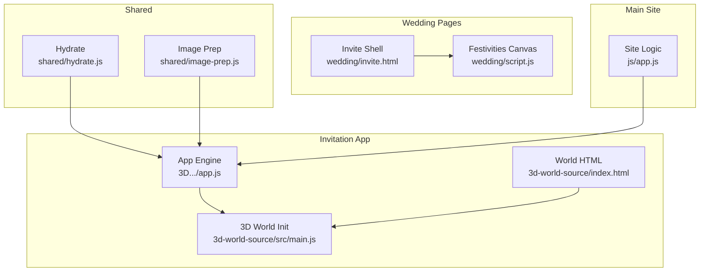
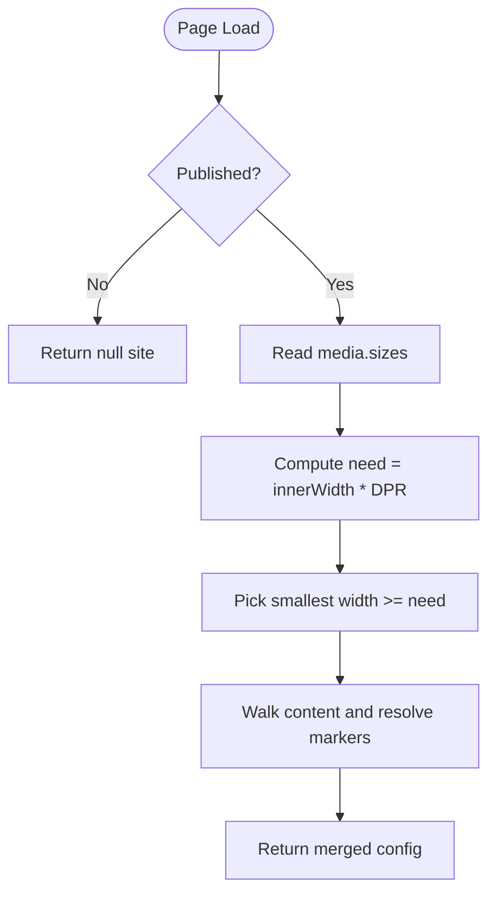
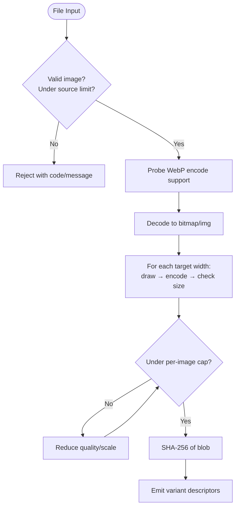
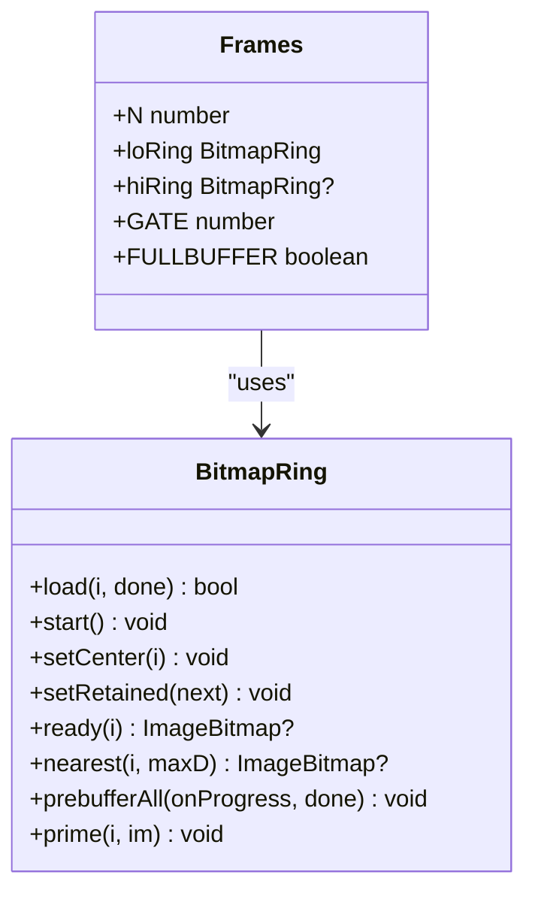
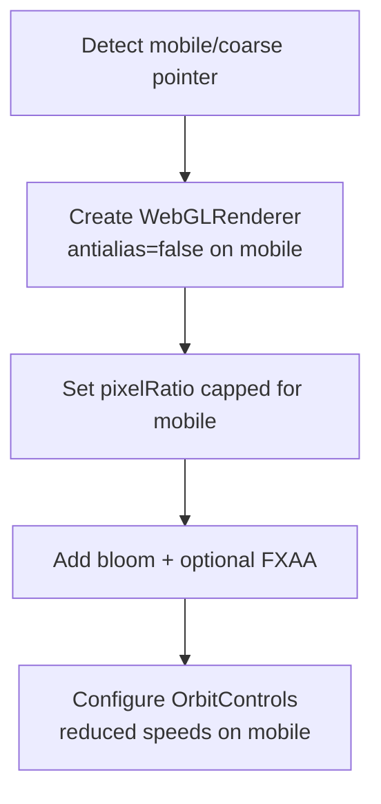
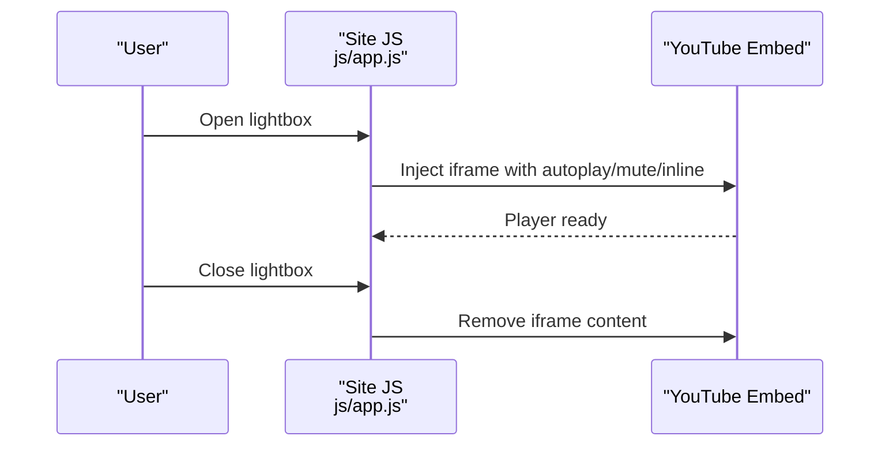
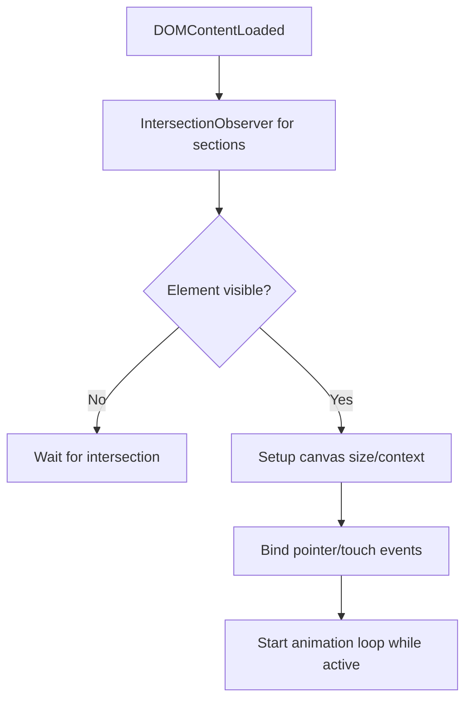
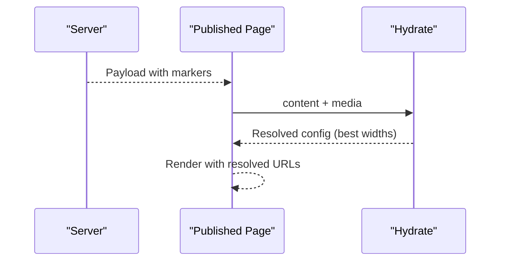
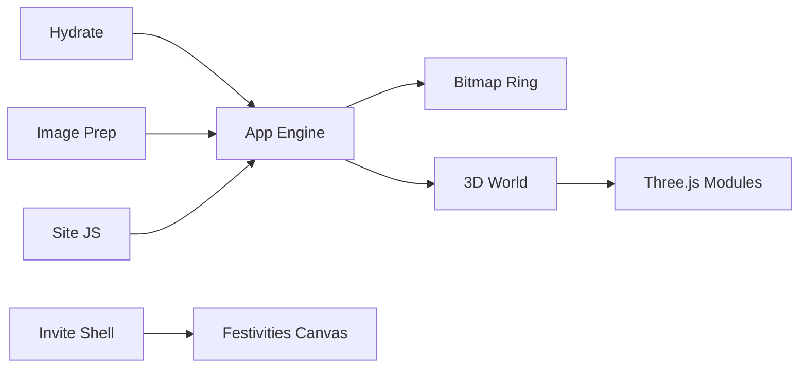

# Media Loading & Optimization

<cite>
**Referenced Files in This Document**
- [hydrate.js](file://shared/hydrate.js)
- [image-prep.js](file://shared/image-prep.js)
- [app.js](file://3D Wedding Invitation Sample 2/app.js)
- [main.js](file://3D Wedding Invitation Sample 2/3d-world-source/src/main.js)
- [index.html](file://3D Wedding Invitation Sample 2/3d-world-source/index.html)
- [script.js](file://wedding/script.js)
- [invite.html](file://wedding/invite.html)
- [app.js](file://js/app.js)
</cite>

## Table of Contents
1. Introduction
2. Project Structure
3. Core Components
4. Architecture Overview
5. Detailed Component Analysis
6. Dependency Analysis
7. Performance Considerations
8. Troubleshooting Guide
9. Conclusion

## Introduction
This document explains the media loading and optimization system that keeps invitations fast and smooth across devices. It covers:
- Lazy loading for images, videos, and canvas-based experiences with viewport detection and resource prioritization
- Image format selection (WebP vs JPEG), responsive sizing, and caching strategies
- Video loading pipeline with poster frames, progressive loading, and memory management
- Hydration for published invitations, dynamic asset resolution, and fallbacks for older browsers
- Practical examples for optimizing assets, implementing custom loading strategies, and monitoring performance

## Project Structure
The media pipeline spans shared utilities, client-side loaders, and interactive experiences:
- Shared utilities handle image preparation and hydration of published content
- The 3D invitation app orchestrates frame scrubs, video bands, and rendering budgets
- The 3D world initializes a Three.js scene with mobile-aware settings
- Wedding pages provide interactive canvases and lazy-loaded galleries
- Main site wires up hero video and lightbox behaviors



**Diagram sources**
- [hydrate.js:1-207](file://shared/hydrate.js#L1-L207)
- [image-prep.js:1-360](file://shared/image-prep.js#L1-L360)
- [app.js:1-200](file://3D Wedding Invitation Sample 2/app.js#L1-L200)
- [main.js:138-188](file://3D Wedding Invitation Sample 2/3d-world-source/src/main.js#L138-L188)
- [index.html:200-283](file://3D Wedding Invitation Sample 2/3d-world-source/index.html#L200-L283)
- [script.js:103-218](file://wedding/script.js#L103-L218)
- [invite.html:113-128](file://wedding/invite.html#L113-L128)
- [app.js:26-29](file://js/app.js#L26-L29)

**Section sources**
- [hydrate.js:1-207](file://shared/hydrate.js#L1-L207)
- [image-prep.js:1-360](file://shared/image-prep.js#L1-L360)
- [app.js:1-200](file://3D Wedding Invitation Sample 2/app.js#L1-L200)
- [main.js:138-188](file://3D Wedding Invitation Sample 2/3d-world-source/src/main.js#L138-L188)
- [index.html:200-283](file://3D Wedding Invitation Sample 2/3d-world-source/index.html#L200-L283)
- [script.js:103-218](file://wedding/script.js#L103-L218)
- [invite.html:113-128](file://wedding/invite.html#L113-L128)
- [app.js:26-29](file://js/app.js#L26-L29)

## Core Components
- Hydration layer resolves server-provided markers into device-appropriate URLs once per page load, selecting the best width based on viewport and DPR.
- Image prep encodes uploads to WebP or JPEG, generates multiple sizes, enforces size caps, and computes hashes for resumable uploads.
- Frame scrub engine loads low- and high-res frame sequences via a bitmap ring buffer, prebuffers when capable, and evicts off-screen bitmaps to bound memory.
- 3D world initialization adapts renderer quality, shadows, and effects for mobile vs desktop.
- Wedding pages implement canvas interactions lazily and use IntersectionObserver to start heavy work only when visible.
- Main site sets up hero video embeds and lightbox behavior without blocking initial paint.

**Section sources**
- [hydrate.js:32-104](file://shared/hydrate.js#L32-L104)
- [image-prep.js:33-64](file://shared/image-prep.js#L33-L64)
- [image-prep.js:151-177](file://shared/image-prep.js#L151-L177)
- [image-prep.js:204-270](file://shared/image-prep.js#L204-L270)
- [app.js:357-477](file://3D Wedding Invitation Sample 2/app.js#L357-L477)
- [main.js:138-188](file://3D Wedding Invitation Sample 2/3d-world-source/src/main.js#L138-L188)
- [script.js:103-218](file://wedding/script.js#L103-L218)
- [app.js:26-29](file://js/app.js#L26-L29)

## Architecture Overview
The system combines three layers:
- Content hydration: converts placeholders to real URLs tailored to the device
- Asset preparation: compresses and variants user images before upload
- Runtime loading: lazy, prioritized, and memory-bounded loading for frames, videos, and canvases

```mermaid
sequenceDiagram
participant U as "User Agent"
participant H as "Hydrate<br/>shared/hydrate.js"
participant A as "App Engine<br/>3D.../app.js"
participant R as "Ring Buffer<br/>Bitmap Ring"
participant W as "3D World<br/>src/main.js"
U->>H : Load published content with markers
H-->>U : Resolved config + media URLs (best width)
U->>A : Initialize invitation
A->>R : Start frame streaming (low-res first)
R-->>A : Ready frames near viewport
A->>W : Create renderer/camera (mobile-aware)
W-->>A : Scene ready
Note over A,R : Evict off-screen bitmaps; prebuffer if capable
```

**Diagram sources**
- [hydrate.js:42-104](file://shared/hydrate.js#L42-L104)
- [app.js:357-477](file://3D Wedding Invitation Sample 2/app.js#L357-L477)
- [main.js:138-188](file://3D Wedding Invitation Sample 2/3d-world-source/src/main.js#L138-L188)

## Detailed Component Analysis

### Hydration: Marker Resolution and Responsive Selection
- Detects published mode and reads DD_SITE safely
- Chooses the best image width from available sizes using innerWidth and devicePixelRatio
- Walks content to replace markers with resolved URLs while preserving non-markers
- Provides deep merge utilities to combine template defaults with overrides



**Diagram sources**
- [hydrate.js:32-104](file://shared/hydrate.js#L32-L104)

**Section sources**
- [hydrate.js:32-104](file://shared/hydrate.js#L32-L104)

### Image Preparation: Format Selection, Variants, and Limits
- Probes WebP encoding capability once and caches result
- Decodes via createImageBitmap with img fallback for compatibility
- Draws to canvas with smoothing enabled and exports blobs
- Generates two variants (e.g., 640w and 1280w), stepping down quality and then pixel scale until under cap
- Computes SHA-256 for each variant to support resume and deduplication
- Enforces per-image and total media limits; reports clear errors



**Diagram sources**
- [image-prep.js:43-64](file://shared/image-prep.js#L43-L64)
- [image-prep.js:68-125](file://shared/image-prep.js#L68-L125)
- [image-prep.js:151-177](file://shared/image-prep.js#L151-L177)
- [image-prep.js:181-195](file://shared/image-prep.js#L181-L195)
- [image-prep.js:204-270](file://shared/image-prep.js#L204-L270)

**Section sources**
- [image-prep.js:33-64](file://shared/image-prep.js#L33-L64)
- [image-prep.js:151-177](file://shared/image-prep.js#L151-L177)
- [image-prep.js:204-270](file://shared/image-prep.js#L204-L270)

### Frame Scrubbing: Lazy Loading, Prioritization, Memory Management
- Bitmap ring buffer maintains a sliding window around the current frame index
- Loads ahead and behind with concurrency limits; evicts bitmaps outside retention window
- Uses createImageBitmap where available; falls back to async decoding via Image.decode
- Prebuffers entire sequence on capable devices to eliminate scrub stalls
- Tiers by device capabilities (memory, network) to choose lite/mid/full modes



**Diagram sources**
- [app.js:357-477](file://3D Wedding Invitation Sample 2/app.js#L357-L477)

**Section sources**
- [app.js:357-477](file://3D Wedding Invitation Sample 2/app.js#L357-L477)
- [app.js:479-497](file://3D Wedding Invitation Sample 2/app.js#L479-L497)

### 3D World Initialization: Mobile-Aware Rendering
- Detects mobile/coarse pointer and reduces antialiasing, shadow map size, and post-processing
- Sets pixel ratio conservatively on touch devices
- Configures controls and tone mapping for performance and visual quality balance



**Diagram sources**
- [main.js:111-188](file://3D Wedding Invitation Sample 2/3d-world-source/src/main.js#L111-L188)

**Section sources**
- [main.js:111-188](file://3D Wedding Invitation Sample 2/3d-world-source/src/main.js#L111-L188)

### Video Pipeline: Poster Frames, Progressive Loading, Lightbox
- Hero section embeds a muted, autoplay YouTube loop via nocookie domain
- Lightbox opens an embedded player only when needed, stopping scroll animations during playback
- Fallbacks ensure safe attributes and inline playback on mobile



**Diagram sources**
- [app.js:26-29](file://js/app.js#L26-L29)
- [app.js:146-188](file://js/app.js#L146-L188)

**Section sources**
- [app.js:26-29](file://js/app.js#L26-L29)
- [app.js:146-188](file://js/app.js#L146-L188)

### Canvas Interactions: Lazy Initialization and Viewport Detection
- Each canvas feature is initialized on DOMContentLoaded and guarded by element existence checks
- Rub-to-reveal and trace-heart use requestAnimationFrame loops only while active
- IntersectionObserver defers heavy setup until elements are near the viewport



**Diagram sources**
- [script.js:103-218](file://wedding/script.js#L103-L218)

**Section sources**
- [script.js:103-218](file://wedding/script.js#L103-L218)

### Published Invitations: Hydration and Dynamic Assets
- Published pages receive server-provided content with media markers
- Hydrate resolves markers to device-appropriate URLs once, avoiding per-element decisions
- Deep merge ensures arrays are replaced wholesale to avoid stale sample data leaking in



**Diagram sources**
- [hydrate.js:32-104](file://shared/hydrate.js#L32-L104)

**Section sources**
- [hydrate.js:32-104](file://shared/hydrate.js#L32-L104)

## Dependency Analysis
- Hydration depends on DD_PUBLISHED and DD_SITE globals set by the server
- Image prep uses browser APIs (createImageBitmap, canvas.toBlob, crypto.subtle) with graceful fallbacks
- Frame scrubbing depends on createImageBitmap availability and device capability probes
- 3D world depends on Three.js modules and post-processing passes
- Wedding pages depend on DOM structure and event listeners for canvas features



**Diagram sources**
- [hydrate.js:32-104](file://shared/hydrate.js#L32-L104)
- [image-prep.js:43-64](file://shared/image-prep.js#L43-L64)
- [app.js:357-477](file://3D Wedding Invitation Sample 2/app.js#L357-L477)
- [main.js:1-23](file://3D Wedding Invitation Sample 2/3d-world-source/src/main.js#L1-L23)
- [script.js:103-218](file://wedding/script.js#L103-L218)
- [app.js:26-29](file://js/app.js#L26-L29)

**Section sources**
- [hydrate.js:32-104](file://shared/hydrate.js#L32-L104)
- [image-prep.js:43-64](file://shared/image-prep.js#L43-L64)
- [app.js:357-477](file://3D Wedding Invitation Sample 2/app.js#L357-L477)
- [main.js:1-23](file://3D Wedding Invitation Sample 2/3d-world-source/src/main.js#L1-L23)
- [script.js:103-218](file://wedding/script.js#L103-L218)
- [app.js:26-29](file://js/app.js#L26-L29)

## Performance Considerations
- Prefer WebP when supported; fall back to JPEG for older iOS Safari
- Use createImageBitmap for faster decode paths; fall back to Image with async decode
- Limit concurrent decodes to avoid memory spikes on mid-range devices
- Evict off-screen bitmaps aggressively; retain only a small window around the viewport
- Prebuffer full frame sequences on capable devices to eliminate scrub stalls
- Reduce renderer quality on mobile (antialias, shadow maps, post-processing)
- Defer heavy canvas work until elements intersect the viewport
- Avoid downloading videos until needed; use posters and lazy src assignment

[No sources needed since this section provides general guidance]

## Troubleshooting Guide
Common issues and remedies:
- Images fail to decode: ensure secure context for crypto.subtle; verify file type and size limits
- Excessive memory usage: reduce concurrent decodes; enable eviction; lower pixel ratio on mobile
- Stuttering scrubbing: enable prebuffering on capable devices; ensure rings have sufficient ahead/behind windows
- Videos not playing inline: ensure playsinline and proper embed parameters; open lightbox only on interaction
- Canvas interactions not starting: confirm elements exist and are visible; initialize after intersection

**Section sources**
- [image-prep.js:181-195](file://shared/image-prep.js#L181-L195)
- [image-prep.js:204-270](file://shared/image-prep.js#L204-L270)
- [app.js:357-477](file://3D Wedding Invitation Sample 2/app.js#L357-L477)
- [main.js:138-188](file://3D Wedding Invitation Sample 2/3d-world-source/src/main.js#L138-L188)
- [script.js:103-218](file://wedding/script.js#L103-L218)
- [app.js:146-188](file://js/app.js#L146-L188)

## Conclusion
The system balances quality and performance by:
- Selecting optimal image formats and sizes per device
- Streaming and caching frames with bounded memory
- Deferring heavy work until necessary
- Hydrating published content with precise, device-aware URLs
Adopt these patterns to keep invitations fast, reliable, and delightful across all devices.

[No sources needed since this section summarizes without analyzing specific files]