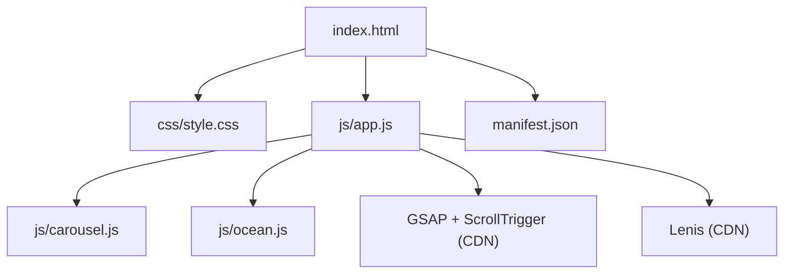
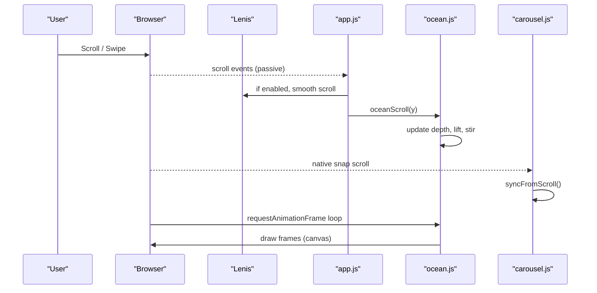
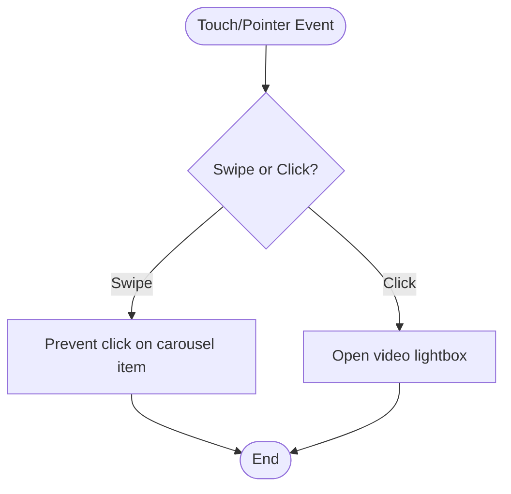
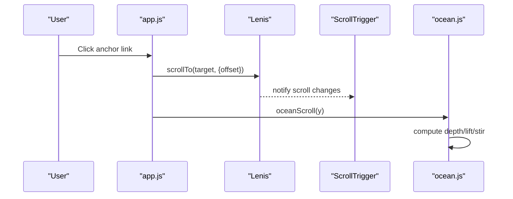
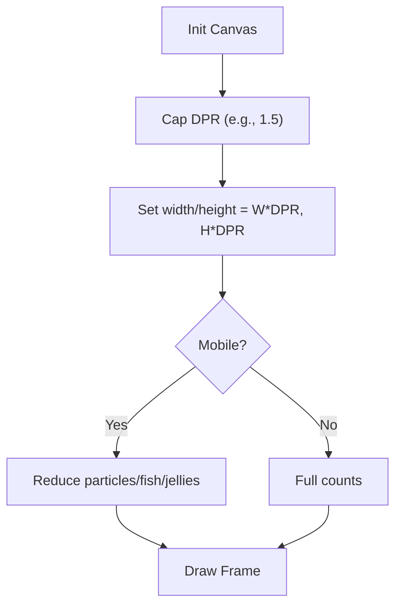
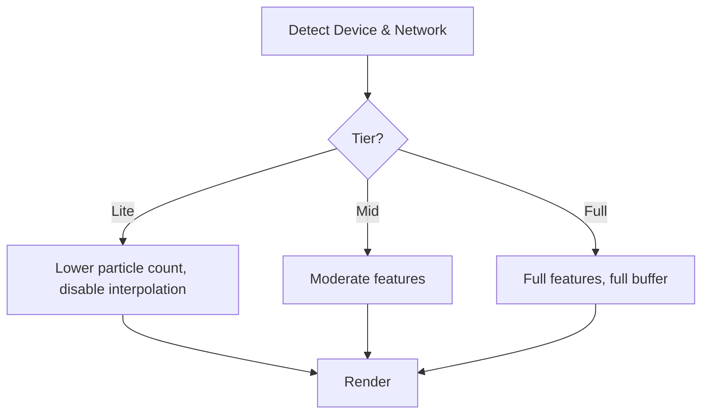
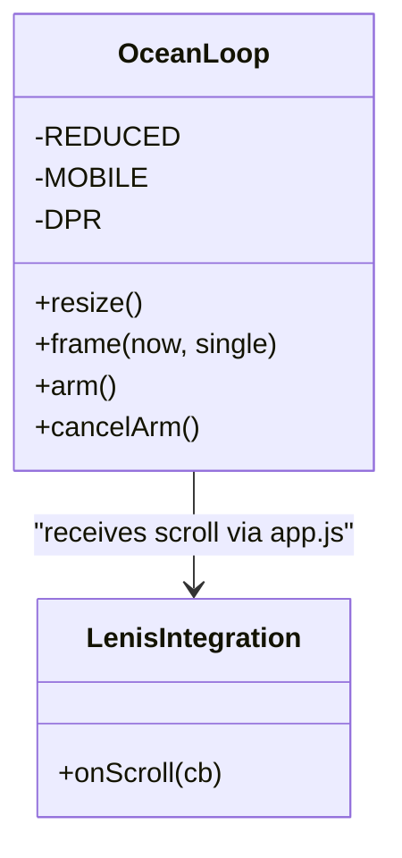
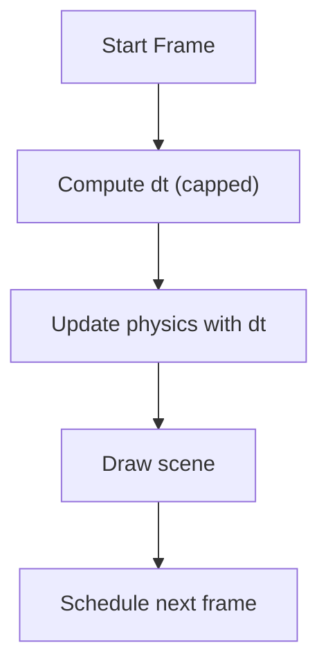
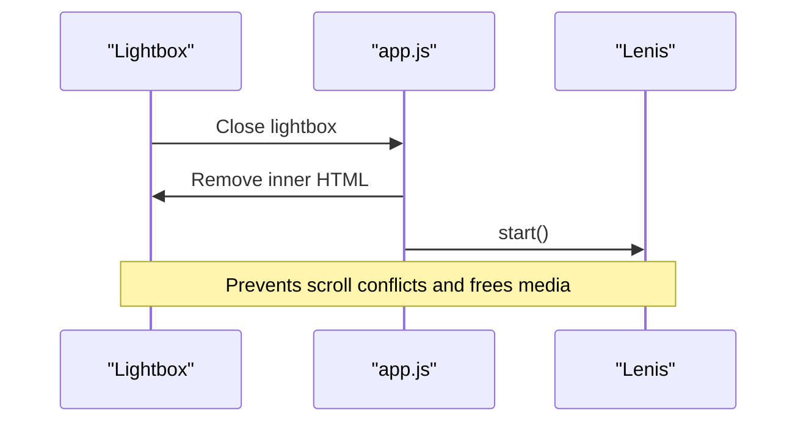
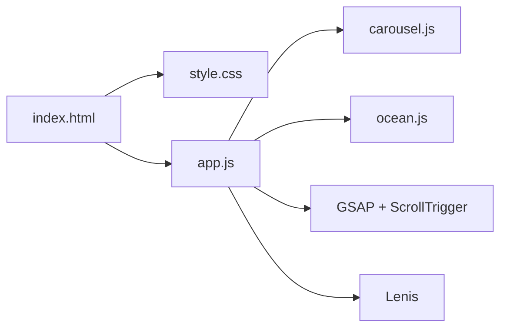

# Mobile Performance Tuning

<cite>
**Referenced Files in This Document**
- [index.html](file://index.html)
- [css/style.css](file://css/style.css)
- [js/app.js](file://js/app.js)
- [js/carousel.js](file://js/carousel.js)
- [js/ocean.js](file://js/ocean.js)
- [manifest.json](file://manifest.json)
- [3D Wedding Invitation Sample 2/app.js](file://3D%20Wedding%20Invitation%20Sample%202/app.js)
- [shared/hydrate.js](file://shared/hydrate.js)
</cite>

## Table of Contents
1. Introduction
2. Project Structure
3. Core Components
4. Architecture Overview
5. Detailed Component Analysis
6. Dependency Analysis
7. Performance Considerations
8. Troubleshooting Guide
9. Conclusion
10. Appendices

## Introduction
This document explains how the project is optimized for mobile devices (smartphones and tablets). It covers touch gesture handling, scroll performance, memory management, adaptive quality based on device capabilities and network conditions, canvas rendering optimizations, animation frame rate management, resource cleanup, mobile-specific CSS techniques, viewport handling, accessibility considerations, testing strategies, and debugging tips.

## Project Structure
The site uses a single-page layout with:
- A full-screen animated ocean background rendered on a canvas behind content
- Native scroll-snap carousels for videos and galleries
- GSAP + ScrollTrigger for entrance animations
- Lenis smooth scrolling when available
- A PWA manifest for app-like behavior on mobile
- Mobile-first responsive CSS with reduced-motion support

**Diagram sources**
- [index.html:1-362](file://index.html#L1-L362)
- [css/style.css:1-635](file://css/style.css#L1-L635)
- [js/app.js:1-210](file://js/app.js#L1-L210)
- [js/carousel.js:1-569](file://js/carousel.js#L1-L569)
- [js/ocean.js:1-642](file://js/ocean.js#L1-L642)
- [manifest.json:1-25](file://manifest.json#L1-L25)

**Section sources**
- [index.html:1-362](file://index.html#L1-L362)
- [css/style.css:1-635](file://css/style.css#L1-L635)
- [js/app.js:1-210](file://js/app.js#L1-L210)
- [js/carousel.js:1-569](file://js/carousel.js#L1-L569)
- [js/ocean.js:1-642](file://js/ocean.js#L1-L642)
- [manifest.json:1-25](file://manifest.json#L1-L25)

## Core Components
- Ocean canvas background: full-screen animated scene with fish, marine snow, god rays, and jellyfish; adapts to device size, DPR, and motion preferences.
- Carousel system: native CSS scroll-snap rails with lightweight JS for navigation and dot indicators; passive event listeners for smooth scrolling.
- App shell: preloader, header behavior, anchor scrolling via Lenis, GSAP entrance animations, lightbox for videos, UPI modal, marquee.
- PWA manifest: standalone display, orientation, theme colors, icons.

Key mobile behaviors:
- Touch-friendly carousels with inertial scrolling and snap alignment
- Passive scroll/pointer events to avoid jank
- Reduced-motion respect for animations and canvas speed
- DPR-aware canvas sizing with capped resolution
- Adaptive particle counts and feature toggles based on capability detection

**Section sources**
- [js/ocean.js:27-79](file://js/ocean.js#L27-L79)
- [js/carousel.js:213-322](file://js/carousel.js#L213-L322)
- [js/app.js:44-110](file://js/app.js#L44-L110)
- [css/style.css:425-477](file://css/style.css#L425-L477)
- [manifest.json:1-25](file://manifest.json#L1-L25)

## Architecture Overview
High-level flow from user interaction to rendering:

**Diagram sources**
- [js/app.js:44-110](file://js/app.js#L44-L110)
- [js/ocean.js:68-79](file://js/ocean.js#L68-L79)
- [js/carousel.js:231-250](file://js/carousel.js#L231-L250)

## Detailed Component Analysis

### Touch Gesture Handling
- Carousels use native CSS scroll-snap with `touch-action: pan-x pan-y` and `-webkit-overflow-scrolling: touch`. Pointer events are used with passive listeners to detect swipes vs clicks and prevent accidental lightbox triggers after a drag.
- The ocean canvas listens to pointerdown to scatter fish, using proximity-based forces and panic decay.

**Diagram sources**
- [js/carousel.js:231-248](file://js/carousel.js#L231-L248)
- [js/ocean.js:81-102](file://js/ocean.js#L81-L102)

**Section sources**
- [css/style.css:425-477](file://css/style.css#L425-L477)
- [js/carousel.js:231-248](file://js/carousel.js#L231-L248)
- [js/ocean.js:81-102](file://js/ocean.js#L81-L102)

### Scroll Performance Improvements
- Lenis smooth scroll is initialized only when available and not reduced-motion, then integrated with GSAP ScrollTrigger updates.
- Anchor links are intercepted to use Lenis scrollTo with offset, avoiding layout thrash.
- Scroll handlers are passive where possible; ocean scroll state is fed via a single function to decouple raw scroll from rendering.

**Diagram sources**
- [js/app.js:44-56](file://js/app.js#L44-L56)
- [js/app.js:99-110](file://js/app.js#L99-L110)
- [js/ocean.js:68-79](file://js/ocean.js#L68-L79)

**Section sources**
- [js/app.js:44-110](file://js/app.js#L44-L110)

### Memory Management Strategies
- Canvas DPR is capped to balance sharpness and memory usage; ocean uses a cap of 1.5x DPR.
- Particle counts and element counts are reduced on mobile (e.g., fewer rays, snow, fish, jellyfish).
- IntersectionObserver is used elsewhere in the codebase to defer heavy work until elements are visible.
- Image decoding and bitmap rings are used in the 3D invitation sample to avoid main-thread decode stalls and keep memory bounded by evicting bitmaps outside the ring.

**Diagram sources**
- [js/ocean.js:34-51](file://js/ocean.js#L34-L51)
- [js/ocean.js:104-141](file://js/ocean.js#L104-L141)
- [3D Wedding Invitation Sample 2/app.js:479-489](file://3D%20Wedding%20Invitation%20Sample%202/app.js#L479-L489)

**Section sources**
- [js/ocean.js:34-51](file://js/ocean.js#L34-L51)
- [js/ocean.js:104-141](file://js/ocean.js#L104-L141)
- [3D Wedding Invitation Sample 2/app.js:479-489](file://3D%20Wedding%20Invitation%20Sample%202/app.js#L479-L489)

### Adaptive Quality System
- Capability tier detection considers device memory and connection type to choose rendering fidelity (lite/mid/full), controlling interpolation and buffer sizes in the 3D invitation engine.
- Reduced-motion preference reduces animation intensity and speeds; ocean slows time base instead of freezing visuals.
- Network save-data mode disables certain features like phone mockup scrubbing in the 3D sample.

**Diagram sources**
- [3D Wedding Invitation Sample 2/app.js:479-489](file://3D%20Wedding%20Invitation%20Sample%202/app.js#L479-L489)
- [js/ocean.js:34-35](file://js/ocean.js#L34-L35)
- [js/ocean.js:619-625](file://js/ocean.js#L619-L625)

**Section sources**
- [3D Wedding Invitation Sample 2/app.js:479-489](file://3D%20Wedding%20Invitation%20Sample%202/app.js#L479-L489)
- [js/ocean.js:34-35](file://js/ocean.js#L34-L35)
- [js/ocean.js:619-625](file://js/ocean.js#L619-L625)

### Canvas Rendering Optimizations
- DPR-aware sizing with capping to reduce GPU/memory pressure.
- Hybrid animation driver: requestAnimationFrame with a setTimeout watchdog to ensure progress even if rAF is throttled or cancelled.
- Time-stepped physics using delta time so behavior is consistent across refresh rates.
- Visibility change handling pauses/resumes loops to save resources when tabs are hidden.

**Diagram sources**
- [js/ocean.js:40-51](file://js/ocean.js#L40-L51)
- [js/ocean.js:437-445](file://js/ocean.js#L437-L445)
- [js/ocean.js:629-632](file://js/ocean.js#L629-L632)
- [js/app.js:44-56](file://js/app.js#L44-L56)

**Section sources**
- [js/ocean.js:40-51](file://js/ocean.js#L40-L51)
- [js/ocean.js:437-445](file://js/ocean.js#L437-L445)
- [js/ocean.js:629-632](file://js/ocean.js#L629-L632)
- [js/app.js:44-56](file://js/app.js#L44-L56)

### Animation Frame Rate Management
- GSAP ScrollTrigger drives reveal animations with efficient scroll-linked tweens.
- Ocean uses dt-based stepping and caps dt to avoid large jumps on slow frames.
- Petal/spark effects in the 3D sample throttle painting frequency based on device capability and touch presence.

**Diagram sources**
- [js/ocean.js:453-475](file://js/ocean.js#L453-L475)
- [3D Wedding Invitation Sample 2/app.js:963-971](file://3D%20Wedding%20Invitation%20Sample%202/app.js#L963-L971)

**Section sources**
- [js/ocean.js:453-475](file://js/ocean.js#L453-L475)
- [3D Wedding Invitation Sample 2/app.js:963-971](file://3D%20Wedding%20Invitation%20Sample%202/app.js#L963-L971)

### Resource Cleanup Procedures
- Lightbox closes clear inner content after a delay to release iframe resources.
- Lenis is paused while modals are open and resumed on close to avoid conflicting scroll states.
- Visibility change handlers pause/resume audio contexts and animation loops.

**Diagram sources**
- [js/app.js:183-188](file://js/app.js#L183-L188)
- [js/app.js:193-196](file://js/app.js#L193-L196)
- [3D Wedding Invitation Sample 2/app.js:335-338](file://3D%20Wedding%20Invitation%20Sample%202/app.js#L335-L338)

**Section sources**
- [js/app.js:183-188](file://js/app.js#L183-L188)
- [js/app.js:193-196](file://js/app.js#L193-L196)
- [3D Wedding Invitation Sample 2/app.js:335-338](file://3D%20Wedding%20Invitation%20Sample%202/app.js#L335-L338)

### Mobile-Specific CSS Techniques
- Viewport meta tag includes `viewport-fit=cover` for safe area support.
- Smooth scrolling via CSS and Lenis integration; Lenis classes override default behavior when active.
- Touch-friendly carousels with native snap scrolling and hidden scrollbars.
- Media queries adjust carousel controls and grid layouts for phones/tablets.
- Reduced-motion media query disables animations and transitions for accessibility.

**Section sources**
- [index.html:4-5](file://index.html#L4-L5)
- [css/style.css:20-22](file://css/style.css#L20-L22)
- [css/style.css:425-477](file://css/style.css#L425-L477)
- [css/style.css:314-316](file://css/style.css#L314-L316)

### Viewport Handling
- Stable viewport units are computed and set via CSS custom properties in the 3D sample to avoid URL bar jump issues on mobile browsers.
- Resize handlers debounce re-measurements to avoid excessive layout recalculations.

**Section sources**
- [3D Wedding Invitation Sample 2/app.js:152-179](file://3D%20Wedding%20Invitation%20Sample%202/app.js#L152-L179)

### Accessibility Considerations
- Respect for `prefers-reduced-motion` across animations and canvas timing.
- Semantic buttons and labels for carousels and actions.
- ARIA attributes on interactive elements (e.g., carousel dots, lightbox close).
- Images have alt text; decorative elements use `aria-hidden`.

**Section sources**
- [css/style.css:314-316](file://css/style.css#L314-L316)
- [js/carousel.js:304-313](file://js/carousel.js#L304-L313)
- [index.html:44-49](file://index.html#L44-L49)

## Dependency Analysis
- index.html loads CSS and JS modules in order; it also pulls in Lenis, GSAP, and ScrollTrigger from CDN.
- app.js orchestrates UI behavior and integrates Lenis and GSAP; it exposes helpers for carousel.js and manages modals.
- carousel.js builds carousels and delegates video playback to app.js’s lightbox.
- ocean.js renders the background canvas and responds to scroll via app.js.

**Diagram sources**
- [index.html:352-359](file://index.html#L352-L359)
- [js/app.js:1-210](file://js/app.js#L1-L210)
- [js/carousel.js:1-569](file://js/carousel.js#L1-L569)
- [js/ocean.js:1-642](file://js/ocean.js#L1-L642)

**Section sources**
- [index.html:352-359](file://index.html#L352-L359)
- [js/app.js:1-210](file://js/app.js#L1-L210)
- [js/carousel.js:1-569](file://js/carousel.js#L1-L569)
- [js/ocean.js:1-642](file://js/ocean.js#L1-L642)

## Performance Considerations
- Prefer native scrolling and CSS scroll-snap for carousels to leverage hardware acceleration and inertia.
- Use passive event listeners for scroll and pointer interactions to avoid blocking the main thread.
- Cap canvas DPR and reduce particle counts on mobile to limit GPU and memory usage.
- Defer heavy work with IntersectionObserver and lazy loading where applicable.
- Respect reduced-motion preferences to improve UX and conserve battery.
- Use hybrid animation drivers (rAF + fallback timer) to maintain responsiveness under throttling.
- Pause/resume loops and audio on visibility changes to save resources when tabs are hidden.

[No sources needed since this section provides general guidance]

## Troubleshooting Guide
- If carousels feel unresponsive, verify that scroll handlers are passive and that CSS scroll-snap is applied to the track container.
- If the ocean background stutters, check DPR capping and reduced-motion settings; confirm that Lenis is not conflicting with native scroll.
- If videos do not autoplay in lightboxes, ensure playsinline and related attributes are present and that modals pause Lenis during open.
- For memory spikes, inspect canvas sizes and particle counts; consider lowering DPR or reducing element counts on low-memory devices.
- To debug frame pacing, observe the per-frame counter attribute on the canvas and monitor rAF availability.

**Section sources**
- [js/carousel.js:231-248](file://js/carousel.js#L231-L248)
- [js/ocean.js:437-445](file://js/ocean.js#L437-L445)
- [js/app.js:183-188](file://js/app.js#L183-L188)
- [js/ocean.js:419-425](file://js/ocean.js#L419-L425)

## Conclusion
The project employs a combination of native browser features (scroll-snap, passive events, reduced-motion), careful canvas optimization (DPR capping, particle reduction, hybrid animation drivers), and thoughtful integration with third-party libraries (Lenis, GSAP) to deliver smooth mobile experiences. Adaptive quality and resource cleanup further ensure stability and efficiency across devices and networks.

[No sources needed since this section summarizes without analyzing specific files]

## Appendices

### Testing Mobile Performance
- Use device emulation in browser DevTools to simulate various screen sizes, DPR, and CPU throttling.
- Measure scroll performance with the Performance panel; look for long tasks around scroll handlers and canvas drawing.
- Validate carousels’ snap behavior and touch interactions on real devices; ensure no accidental lightbox opens after swipes.
- Check reduced-motion behavior to confirm animations are disabled or slowed appropriately.

[No sources needed since this section provides general guidance]

### Implementing Device-Specific Optimizations
- Detect capability tier using device memory and network info to toggle features (as seen in the 3D invitation sample).
- Apply DPR caps and reduce particle counts on mobile (as implemented in the ocean canvas).
- Use IntersectionObserver to defer heavy initialization until elements are near the viewport.

**Section sources**
- [3D Wedding Invitation Sample 2/app.js:479-489](file://3D%20Wedding%20Invitation%20Sample%202/app.js#L479-L489)
- [js/ocean.js:104-141](file://js/ocean.js#L104-L141)

### Debugging Mobile-Specific Issues
- Inspect the canvas frame counter attribute to verify the render loop is running.
- Confirm Lenis is paused while modals are open to avoid scroll conflicts.
- Verify that passive listeners are used for high-frequency events (scroll, pointermove) to prevent jank.

**Section sources**
- [js/ocean.js:419-425](file://js/ocean.js#L419-L425)
- [js/app.js:183-188](file://js/app.js#L183-L188)
- [js/carousel.js:231-248](file://js/carousel.js#L231-L248)