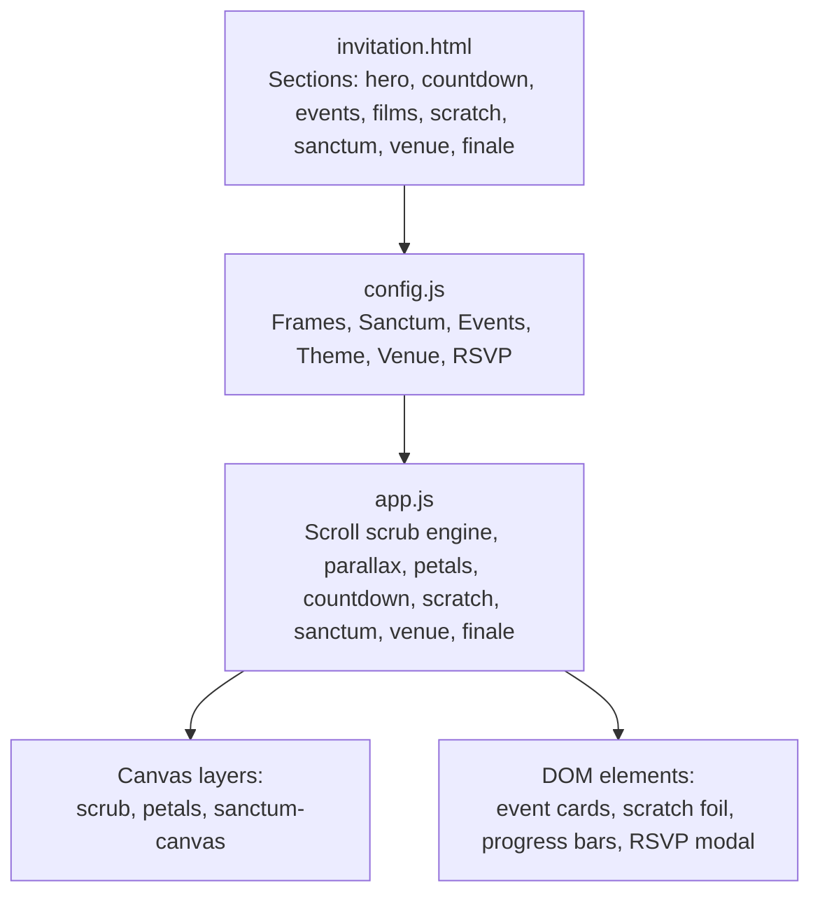
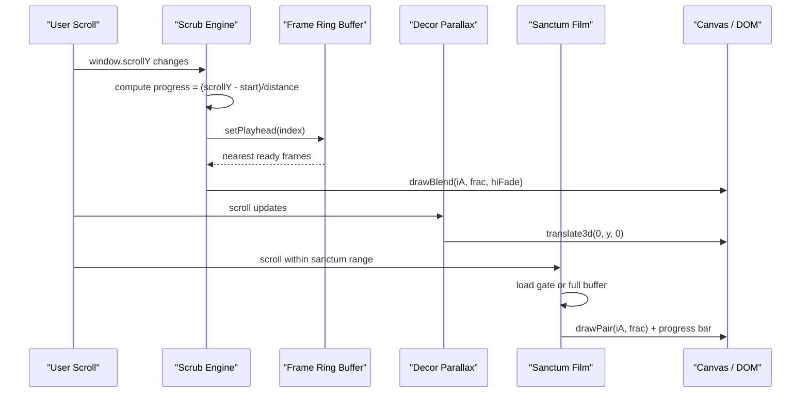
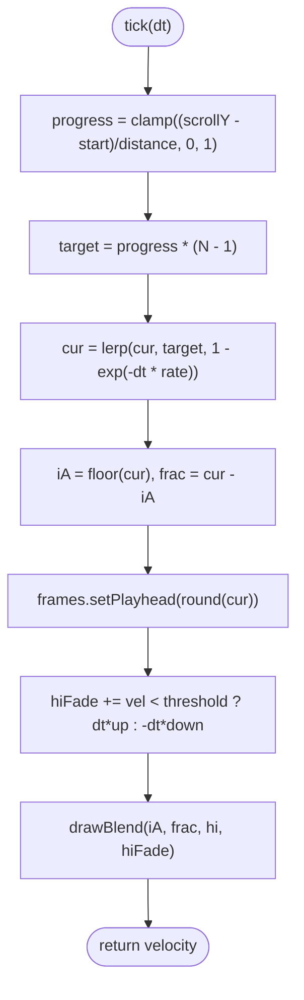
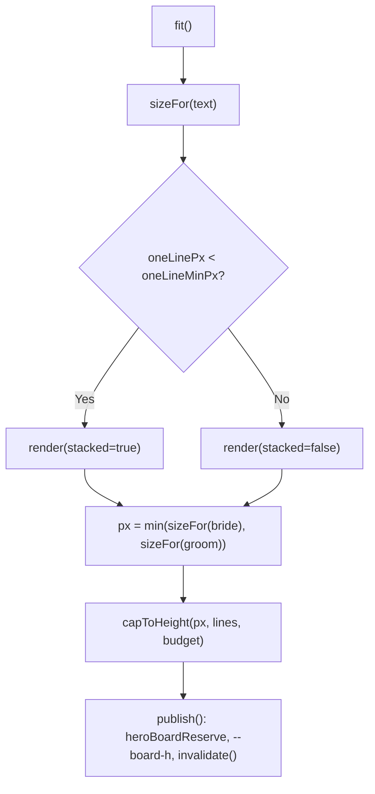
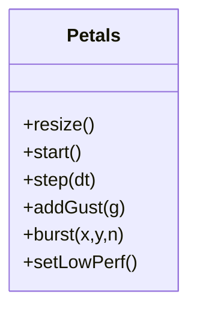
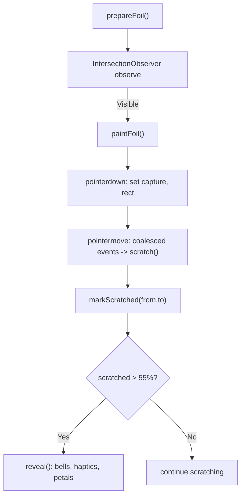
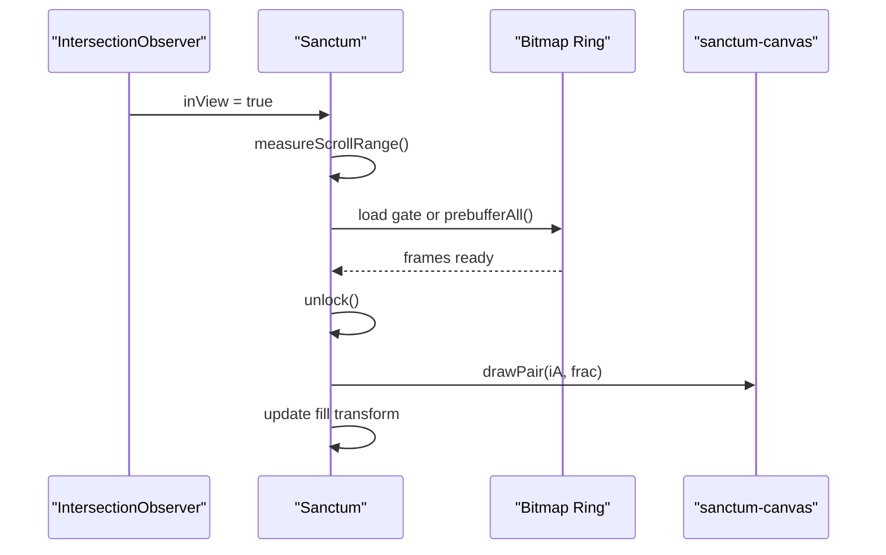
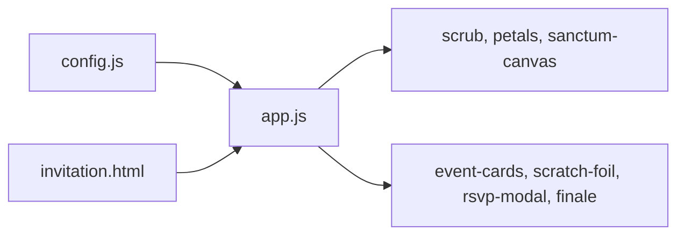

# Scroll Animation Engine

<cite>
**Referenced Files in This Document**
- [app.js](file://3D%20Wedding%20Invitation%20Sample%202/app.js)
- [config.js](file://3D%20Wedding%20Invitation%20Sample%202/config.js)
- [invitation.html](file://3D%20Wedding%20Invitation%20Sample%202/invitation.html)
- [script.js](file://wedding/script.js)
</cite>

## Table of Contents
1. [Introduction](#introduction)
2. [Project Structure](#project-structure)
3. [Core Components](#core-components)
4. [Architecture Overview](#architecture-overview)
5. [Detailed Component Analysis](#detailed-component-analysis)
6. [Dependency Analysis](#dependency-analysis)
7. [Performance Considerations](#performance-considerations)
8. [Troubleshooting Guide](#troubleshooting-guide)
9. [Conclusion](#conclusion)
10. [Appendices](#appendices)

## Introduction
This document explains the scroll-driven animation engine that powers the cinematic wedding invitation experience. It focuses on how scroll position is tracked, timelines are managed, and animations are sequenced across sections. It also covers parallax effects, performance optimizations for mobile devices, and section-based triggers using Intersection Observer patterns. The goal is to help you understand how different scroll positions activate specific animations and how to add new scroll-triggered sections, customize timings, and optimize for various screen sizes and device capabilities.

## Project Structure
The cinematic invitation is implemented as a single-page experience with multiple sections:
- Hero with a frame-scrubbing canvas driven by scroll
- Countdown, events, film bands, scratch card, hidden moment (sanctum), venue & RSVP, and finale
- A separate 3D world accessed via a portal link

Key files:
- HTML structure and section markup define where animations trigger
- Configuration defines assets, counts, paths, and UI text
- Main application script implements the scroll engine, parallax, and per-section behaviors
- Additional scripts provide simpler scroll-triggered reveal animations for other pages

**Diagram sources**
- [invitation.html:94-286](file://3D%20Wedding%20Invitation%20Sample%202/invitation.html#L94-L286)
- [config.js:97-123](file://3D%20Wedding%20Invitation%20Sample%202/config.js#L97-L123)
- [app.js:608-713](file://3D%20Wedding%20Invitation%20Sample%202/app.js#L608-L713)

**Section sources**
- [invitation.html:94-286](file://3D%20Wedding%20Invitation%20Sample%202/invitation.html#L94-L286)
- [config.js:97-123](file://3D%20Wedding%20Invitation%20Sample%202/config.js#L97-L123)
- [app.js:608-713](file://3D%20Wedding%20Invitation%20Sample%202/app.js#L608-L713)

## Core Components
- Frame ring buffer and scrub engine: Pre-decoded bitmap ring buffers stream frames around the playhead; scroll maps to a normalized progress that drives frame selection and blending.
- Name board auto-fit: Measures and fits couple names into a reserved band so artwork never overlaps it.
- Petals particle system: Ambient particles with gusts and bursts, tuned for touch and low-power modes.
- Countdown timer: Updates until the wedding date.
- Event cards with Intersection Observer reveals: Staggered entrance with audio chimes.
- Scratch card: Canvas-based foil with grid tracking and celebration effects.
- Hidden moment (sanctum): Scroll-unlocked film with prebuffering and progressive unlock.
- Decor parallax: Depth-based transforms applied only when visible.
- Venue & RSVP: Map links, embedded form handling with fallbacks, and accessible modal.
- Finale reveal: Intersection Observer triggers final section reveal.

**Section sources**
- [app.js:347-606](file://3D%20Wedding%20Invitation%20Sample%202/app.js#L347-L606)
- [app.js:715-911](file://3D%20Wedding%20Invitation%20Sample%202/app.js#L715-L911)
- [app.js:913-1012](file://3D%20Wedding%20Invitation%20Sample%202/app.js#L913-L1012)
- [app.js:1014-1034](file://3D%20Wedding%20Invitation%20Sample%202/app.js#L1014-L1034)
- [app.js:1036-1074](file://3D%20Wedding%20Invitation%20Sample%202/app.js#L1036-L1074)
- [app.js:1076-1234](file://3D%20Wedding%20Invitation%20Sample%202/app.js#L1076-L1234)
- [app.js:1236-1385](file://3D%20Wedding%20Invitation%20Sample%202/app.js#L1236-L1385)
- [app.js:1387-1425](file://3D%20Wedding%20Invitation%20Sample%202/app.js#L1387-L1425)
- [app.js:1427-1595](file://3D%20Wedding%20Invitation%20Sample%202/app.js#L1427-L1595)

## Architecture Overview
The engine uses a central loop to update scroll-driven components each frame. Each component tracks its own scroll range and visibility, then computes state and renders accordingly.

**Diagram sources**
- [app.js:608-713](file://3D%20Wedding%20Invitation%20Sample%202/app.js#L608-L713)
- [app.js:1236-1385](file://3D%20Wedding%20Invitation%20Sample%202/app.js#L1236-L1385)
- [app.js:1387-1425](file://3D%20Wedding%20Invitation%20Sample%202/app.js#L1387-L1425)

## Detailed Component Analysis

### Frame Ring Buffer and Scrub Engine
- Bitmap ring buffers maintain ahead/behind windows around the current frame index, evicting old bitmaps to bound memory.
- On capability detection, tiers adjust buffer sizes and whether high-res frames are streamed.
- The scrub engine maps scroll to a normalized progress, smooths the target with exponential decay, and blends adjacent frames for continuous motion. High-resolution frames fade in when motion calms.

**Diagram sources**
- [app.js:608-713](file://3D%20Wedding%20Invitation%20Sample%202/app.js#L608-L713)

**Section sources**
- [app.js:347-606](file://3D%20Wedding%20Invitation%20Sample%202/app.js#L347-L606)
- [app.js:608-713](file://3D%20Wedding%20Invitation%20Sample%202/app.js#L608-L713)

### Name Board Auto-Fit
- Measures available width and height budgets, decides stacking vs single line, and sets font size via CSS custom properties and inline styles.
- Publishes a reserve band height so the scrub renderer knows where not to draw artwork.

**Diagram sources**
- [app.js:715-911](file://3D%20Wedding%20Invitation%20Sample%202/app.js#L715-L911)

**Section sources**
- [app.js:715-911](file://3D%20Wedding%20Invitation%20Sample%202/app.js#L715-L911)

### Petals Particle System
- Pre-rendered petal sprites reduce per-frame work.
- Low-performance mode reduces DPR and particle count; gusts respond to interactions; bursts fire on celebrations.

**Diagram sources**
- [app.js:913-1012](file://3D%20Wedding%20Invitation%20Sample%202/app.js#L913-L1012)

**Section sources**
- [app.js:913-1012](file://3D%20Wedding%20Invitation%20Sample%202/app.js#L913-L1012)

### Countdown Timer
- Computes time remaining to the wedding moment and updates cells every second; shows completion message when reached.

**Section sources**
- [app.js:1014-1034](file://3D%20Wedding%20Invitation%20Sample%202/app.js#L1014-L1034)

### Event Cards Reveal
- Uses Intersection Observer to reveal event cards with staggered delays and optional audio chimes.

**Section sources**
- [app.js:1036-1074](file://3D%20Wedding%20Invitation%20Sample%202/app.js#L1036-L1074)

### Scratch Card
- Paints foil once near viewport, tracks scratched area on a small grid to avoid expensive pixel reads, and triggers celebration effects when enough area is cleared.

**Diagram sources**
- [app.js:1076-1234](file://3D%20Wedding%20Invitation%20Sample%202/app.js#L1076-L1234)

**Section sources**
- [app.js:1076-1234](file://3D%20Wedding%20Invitation%20Sample%202/app.js#L1076-L1234)

### Hidden Moment (Sanctum)
- Loads a gate of frames or fully prebuffers based on device tier; unlocks when enough frames are ready; scroll maps to frame progression with interpolation and progress bar updates.

**Diagram sources**
- [app.js:1236-1385](file://3D%20Wedding%20Invitation%20Sample%202/app.js#L1236-L1385)

**Section sources**
- [app.js:1236-1385](file://3D%20Wedding%20Invitation%20Sample%202/app.js#L1236-L1385)

### Decor Parallax
- Measures element offsets once and applies compositor-friendly translate3d transforms based on depth values while elements are intersecting.

**Section sources**
- [app.js:1387-1425](file://3D%20Wedding%20Invitation%20Sample%202/app.js#L1387-L1425)

### Venue & RSVP
- Normalizes Google Form URLs, embeds when possible, falls back to external link if framing is blocked, and provides an accessible modal with focus management.

**Section sources**
- [app.js:1427-1572](file://3D%20Wedding%20Invitation%20Sample%202/app.js#L1427-L1572)

### Finale Reveal
- Observes the finale section and reveals it when near the bottom of the viewport.

**Section sources**
- [app.js:1574-1595](file://3D%20Wedding%20Invitation%20Sample%202/app.js#L1574-L1595)

### Section-Based Triggers and Intersection Observer Patterns
- Multiple components use Intersection Observer to:
  - Activate/deactivate heavy work (frame retention, drawing)
  - Trigger visual reveals with staggered timing
  - Lazy-load resources before they are needed
- Thresholds and root margins are tuned per section to balance responsiveness and performance.

**Section sources**
- [app.js:624-631](file://3D%20Wedding%20Invitation%20Sample%202/app.js#L624-L631)
- [app.js:1062-1073](file://3D%20Wedding%20Invitation%20Sample%202/app.js#L1062-L1073)
- [app.js:1266-1275](file://3D%20Wedding%20Invitation%20Sample%202/app.js#L1266-L1275)
- [app.js:1395-1402](file://3D%20Wedding%20Invitation%20Sample%202/app.js#L1395-L1402)
- [app.js:1585-1593](file://3D%20Wedding%20Invitation%20Sample%202/app.js#L1585-L1593)

## Dependency Analysis
- Config drives asset paths, counts, and content used by the engine.
- HTML provides section anchors and elements referenced by IDs.
- App script depends on config for frame/sanctum/event data and manipulates DOM/canvas elements defined in HTML.

**Diagram sources**
- [config.js:97-123](file://3D%20Wedding%20Invitation%20Sample%202/config.js#L97-L123)
- [invitation.html:94-286](file://3D%20Wedding%20Invitation%20Sample%202/invitation.html#L94-L286)
- [app.js:608-713](file://3D%20Wedding%20Invitation%20Sample%202/app.js#L608-L713)

**Section sources**
- [config.js:97-123](file://3D%20Wedding%20Invitation%20Sample%202/config.js#L97-L123)
- [invitation.html:94-286](file://3D%20Wedding%20Invitation%20Sample%202/invitation.html#L94-L286)
- [app.js:608-713](file://3D%20Wedding%20Invitation%20Sample%202/app.js#L608-L713)

## Performance Considerations
- Device-tier detection adjusts buffer sizes, streaming limits, and whether high-res frames are used.
- Touch devices use lower frame rates and reduced DPR for petals and other canvases.
- Reduced-motion preferences disable certain animations.
- Save Data and slow network flags reduce resource loading.
- Intersection Observers gate heavy work and lazy-load resources.
- Coalesced pointer events improve scratch interaction efficiency.
- Bitmapped images are decoded off-main-thread and cached in rings to minimize jank.

[No sources needed since this section provides general guidance]

## Troubleshooting Guide
- Opening from file:// URLs: The HTML includes a handler to strip cache-busting query strings so assets load correctly.
- If frames fail to prepare during entry, retry logic attempts multiple times before showing a retry option.
- If the RSVP iframe is blocked, a watchdog falls back to an external link after a timeout.
- If fonts load late, name board fit recalculates to ensure correct layout.

**Section sources**
- [invitation.html:5-21](file://3D%20Wedding%20Invitation%20Sample%202/invitation.html#L5-L21)
- [app.js:516-565](file://3D%20Wedding%20Invitation%20Sample%202/app.js#L516-L565)
- [app.js:1484-1497](file://3D%20Wedding%20Invitation%20Sample%202/app.js#L1484-L1497)
- [app.js:907-909](file://3D%20Wedding%20Invitation%20Sample%202/app.js#L907-L909)

## Conclusion
The scroll-driven animation engine combines a robust frame ring buffer, precise scroll mapping, and targeted Intersection Observer triggers to deliver a cinematic experience optimized for mobile devices. By tuning configuration, adjusting thresholds, and leveraging device capabilities, you can extend the experience with new sections, customize timings, and maintain smooth performance across devices.

[No sources needed since this section summarizes without analyzing specific files]

## Appendices

### How to Add a New Scroll-Triggered Section
- Add a new section in the HTML with a unique ID and any decorative or interactive elements.
- In app.js, create an Intersection Observer to detect when the section enters the viewport and apply your reveal logic (e.g., classes, animations).
- Optionally, map scroll within the section to a timeline or effect similar to the sanctum or scrub engines.
- Use existing utilities like petals.burst or audio.chime for consistent feedback.

**Section sources**
- [invitation.html:94-286](file://3D%20Wedding%20Invitation%20Sample%202/invitation.html#L94-L286)
- [app.js:1062-1073](file://3D%20Wedding%20Invitation%20Sample%202/app.js#L1062-L1073)
- [app.js:1236-1385](file://3D%20Wedding%20Invitation%20Sample%202/app.js#L1236-L1385)

### Customizing Animation Timings
- Adjust smoothing rates in the scrub tick function to change responsiveness.
- Tune Intersection Observer thresholds and root margins to control when triggers fire.
- Modify petal system intervals and counts for ambient motion intensity.

**Section sources**
- [app.js:688-703](file://3D%20Wedding%20Invitation%20Sample%202/app.js#L688-L703)
- [app.js:1062-1073](file://3D%20Wedding%20Invitation%20Sample%202/app.js#L1062-L1073)
- [app.js:965-994](file://3D%20Wedding%20Invitation%20Sample%202/app.js#L965-L994)

### Optimizing for Different Screen Sizes and Devices
- Rely on device-tier detection to automatically scale buffer sizes and streaming behavior.
- Use touch-specific parameters for smoother interactions and lower costs.
- Respect prefers-reduced-motion to disable non-essential animations.

**Section sources**
- [app.js:479-489](file://3D%20Wedding%20Invitation%20Sample%202/app.js#L479-L489)
- [app.js:963-1010](file://3D%20Wedding%20Invitation%20Sample%202/app.js#L963-L1010)