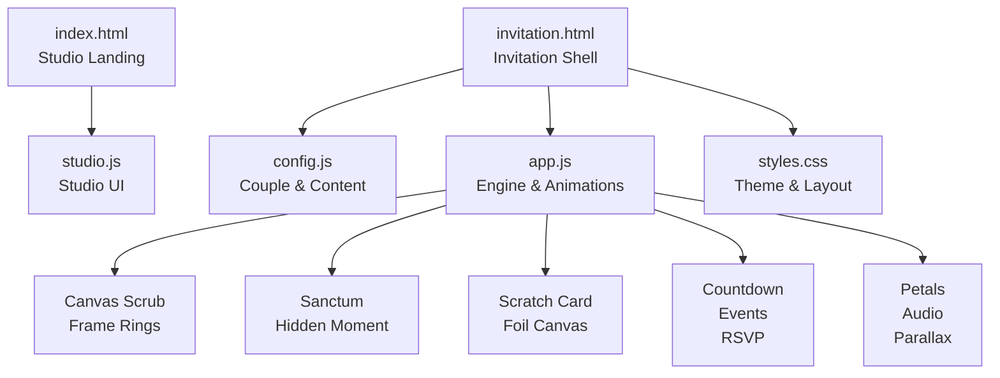
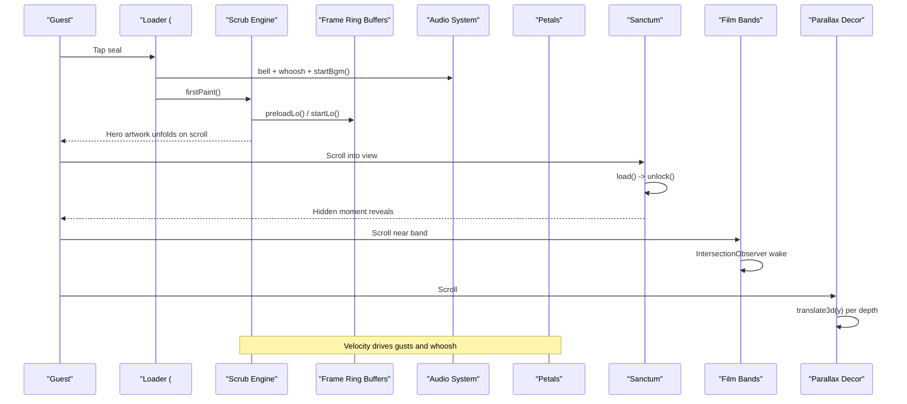
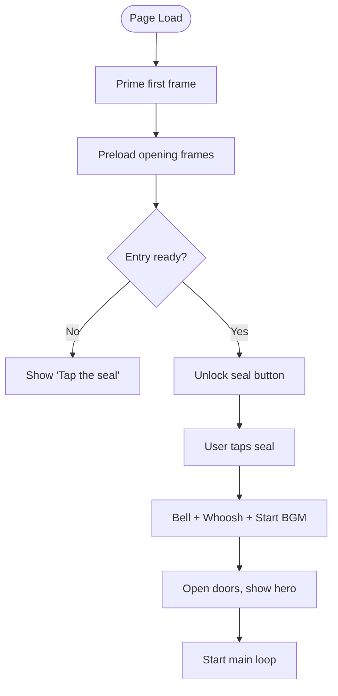
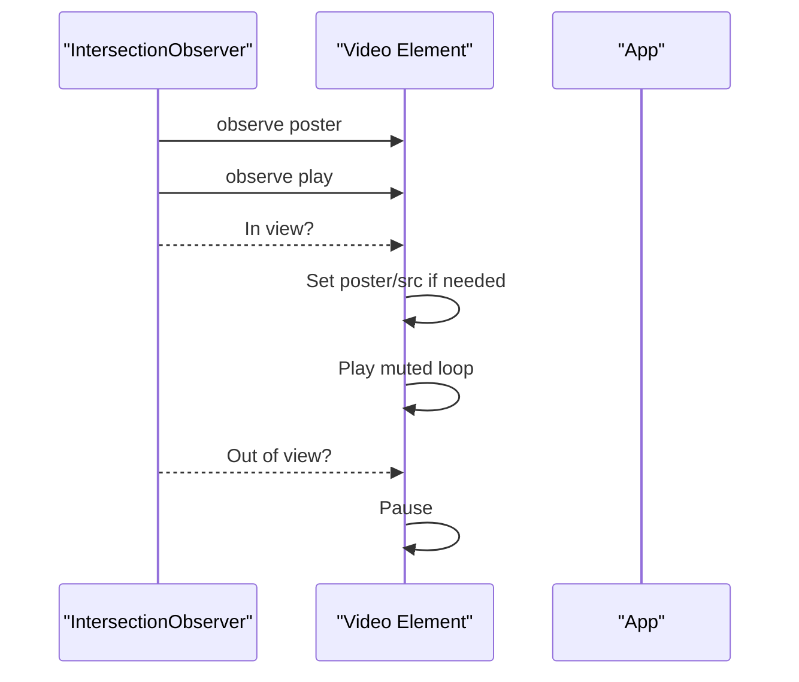
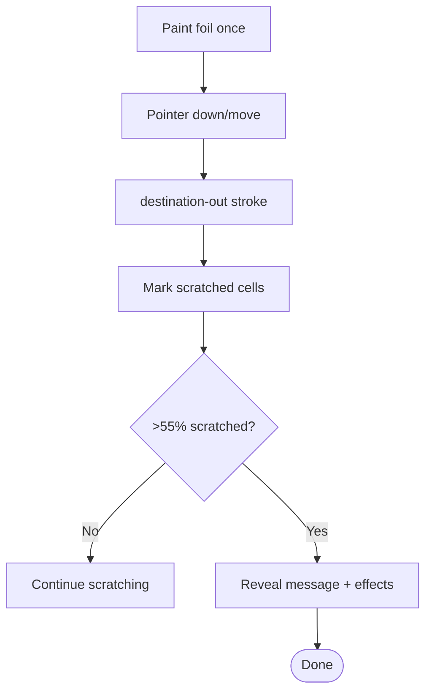
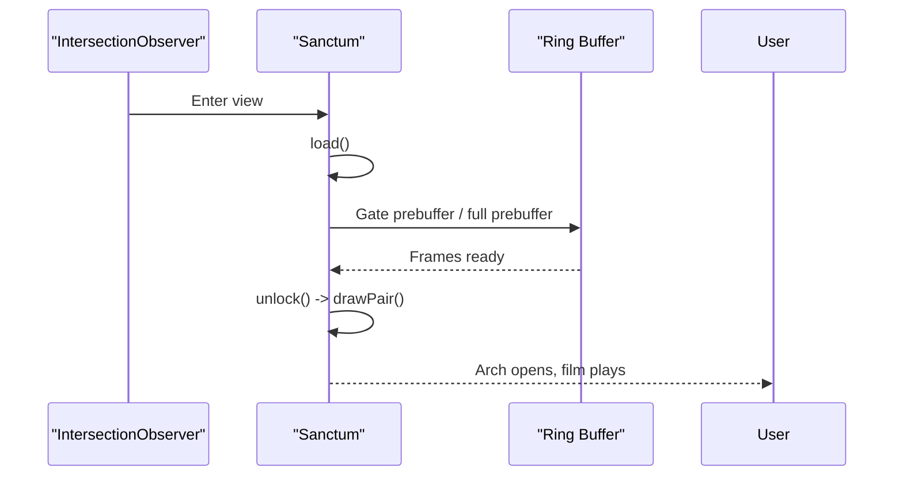
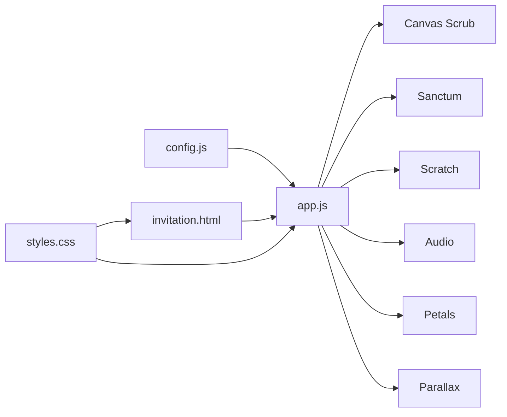

# Scroll-Driven Cinematic Experience

<cite>
**Referenced Files in This Document**
- [index.html](file://3D Wedding Invitation Sample 2/index.html)
- [invitation.html](file://3D Wedding Invitation Sample 2/invitation.html)
- [app.js](file://3D Wedding Invitation Sample 2/app.js)
- [config.js](file://3D Wedding Invitation Sample 2/config.js)
- [styles.css](file://3D Wedding Invitation Sample 2/styles.css)
- [studio.js](file://3D Wedding Invitation Sample 2/studio.js)
- [editor.js](file://3D Wedding Invitation Sample 2/editor.js)
</cite>

## Table of Contents
1. [Introduction](#introduction)
2. [Project Structure](#project-structure)
3. [Core Components](#core-components)
4. [Architecture Overview](#architecture-overview)
5. [Detailed Component Analysis](#detailed-component-analysis)
6. [Dependency Analysis](#dependency-analysis)
7. [Performance Considerations](#performance-considerations)
8. [Troubleshooting Guide](#troubleshooting-guide)
9. [Conclusion](#conclusion)
10. [Appendices](#appendices)

## Introduction
This document explains the scroll-driven cinematic wedding invitation experience built with a custom frame-scrub engine, canvas rendering, and an interactive narrative. It covers how the story unfolds through sections: wax seal opening, photo gallery (film bands), countdown timer, scratch blessing, hidden moment, and finale gateway to a 3D world. The implementation uses native APIs for performance and accessibility, with optional GSAP ScrollTrigger and Lenis smooth scrolling present in a previous design branch.

## Project Structure
The project is organized into a studio landing page and the actual invitation experience:
- Studio landing page: index.html, studio.js, styles.css
- Invitation experience: invitation.html, app.js, config.js, styles.css
- Assets: frames, film clips, audio, decor, stills

**Diagram sources**
- [index.html:48-117](file://3D Wedding Invitation Sample 2/index.html#L48-L117)
- [invitation.html:66-133](file://3D Wedding Invitation Sample 2/invitation.html#L66-L133)
- [app.js:608-713](file://3D Wedding Invitation Sample 2/app.js#L608-L713)
- [app.js:1237-1385](file://3D Wedding Invitation Sample 2/app.js#L1237-L1385)
- [app.js:1076-1234](file://3D Wedding Invitation Sample 2/app.js#L1076-L1234)
- [app.js:1014-1034](file://3D Wedding Invitation Sample 2/app.js#L1014-L1034)
- [config.js:6-123](file://3D Wedding Invitation Sample 2/config.js#L6-L123)
- [styles.css:6-31](file://3D Wedding Invitation Sample 2/styles.css#L6-L31)

**Section sources**
- [index.html:48-117](file://3D Wedding Invitation Sample 2/index.html#L48-L117)
- [invitation.html:66-133](file://3D Wedding Invitation Sample 2/invitation.html#L66-L133)
- [config.js:6-123](file://3D Wedding Invitation Sample 2/config.js#L6-L123)

## Core Components
- Frame scrub engine: pre-decoded bitmap ring buffers, interpolation, high-res fade-in on calm motion
- Sanctum (hidden moment): scroll-unlocked film inside an arch portal
- Scratch blessing: foil canvas with grid-based masking and haptics/audio
- Countdown and events: live countdown, event cards with reveal animations
- Film bands: lazy video loops triggered by visibility
- Parallax decor: compositor-only transforms based on scroll position
- Audio system: synthesized bells, whooshes, background score with mute persistence
- Main loop: FPS guard, scroll thread indicator, petal gusts tied to scrub velocity

**Section sources**
- [app.js:347-606](file://3D Wedding Invitation Sample 2/app.js#L347-L606)
- [app.js:608-713](file://3D Wedding Invitation Sample 2/app.js#L608-L713)
- [app.js:1237-1385](file://3D Wedding Invitation Sample 2/app.js#L1237-L1385)
- [app.js:1076-1234](file://3D Wedding Invitation Sample 2/app.js#L1076-L1234)
- [app.js:1014-1034](file://3D Wedding Invitation Sample 2/app.js#L1014-L1034)
- [app.js:1574-1747](file://3D Wedding Invitation Sample 2/app.js#L1574-L1747)
- [app.js:1387-1425](file://3D Wedding Invitation Sample 2/app.js#L1387-L1425)
- [app.js:1829-1866](file://3D Wedding Invitation Sample 2/app.js#L1829-L1866)

## Architecture Overview
The invitation is a single-page narrative driven by scroll and user interactions. The main loop coordinates multiple subsystems:
- The hero section renders a sequence of images via a canvas scrub engine that maps scroll progress to frame indices.
- The sanctum section unlocks when scrolled into view and plays its own frame sequence.
- Decorative parallax elements move with scroll using cached offsets and CSS transforms.
- Petals and audio respond to scrub velocity and user actions.
- Film bands play when visible; RSVP modal handles form embedding or fallback.

**Diagram sources**
- [app.js:1868-1969](file://3D Wedding Invitation Sample 2/app.js#L1868-L1969)
- [app.js:608-713](file://3D Wedding Invitation Sample 2/app.js#L608-L713)
- [app.js:1237-1385](file://3D Wedding Invitation Sample 2/app.js#L1237-L1385)
- [app.js:1574-1747](file://3D Wedding Invitation Sample 2/app.js#L1574-L1747)
- [app.js:1387-1425](file://3D Wedding Invitation Sample 2/app.js#L1387-L1425)

## Detailed Component Analysis

### Wax Seal Opening (Loader)
- Visual: door panels open, mandala petals light up, progress ring fills
- Behavior: preloads low-res frames, primes first frame for instant paint, starts background music after tap gesture
- Accessibility: aria-label updates with couple names; status text announces preparation progress

**Diagram sources**
- [app.js:1868-1969](file://3D Wedding Invitation Sample 2/app.js#L1868-L1969)

**Section sources**
- [invitation.html:66-88](file://3D Wedding Invitation Sample 2/invitation.html#L66-L88)
- [app.js:1868-1969](file://3D Wedding Invitation Sample 2/app.js#L1868-L1969)

### Photo Gallery (Film Bands)
- Lazy loading: posters set early; videos src assigned only when near viewport
- Playback: IntersectionObserver triggers play after short delay; pause when out of view
- Config-driven: captions and sources hydrated from config

**Diagram sources**
- [app.js:1574-1747](file://3D Wedding Invitation Sample 2/app.js#L1574-L1747)
- [config.js:117-123](file://3D Wedding Invitation Sample 2/config.js#L117-L123)

**Section sources**
- [invitation.html:164-166](file://3D Wedding Invitation Sample 2/invitation.html#L164-L166)
- [invitation.html:217-253](file://3D Wedding Invitation Sample 2/invitation.html#L217-L253)
- [app.js:1574-1747](file://3D Wedding Invitation Sample 2/app.js#L1574-L1747)

### Countdown Timer
- Live countdown to muhurat time with tabular numerals
- Completes with a celebratory message when date passes

**Section sources**
- [invitation.html:135-150](file://3D Wedding Invitation Sample 2/invitation.html#L135-L150)
- [app.js:1014-1034](file://3D Wedding Invitation Sample 2/app.js#L1014-L1034)
- [config.js:17-22](file://3D Wedding Invitation Sample 2/config.js#L17-L22)

### Scratch Blessing
- Foil canvas painted once; scratching uses destination-out compositing
- Grid-based tracking avoids expensive pixel reads; reveals at threshold
- Celebrates with bells, haptics, and petal bursts

**Diagram sources**
- [app.js:1076-1234](file://3D Wedding Invitation Sample 2/app.js#L1076-L1234)

**Section sources**
- [invitation.html:167-187](file://3D Wedding Invitation Sample 2/invitation.html#L167-L187)
- [app.js:1076-1234](file://3D Wedding Invitation Sample 2/app.js#L1076-L1234)

### Hidden Moment (Sanctum)
- Scroll-driven film inside an arch portal; veil fades as it unlocks
- Uses a separate frame ring buffer with gate preloading and full prebuffer on capable devices
- Progress bar reflects current frame index

**Diagram sources**
- [app.js:1237-1385](file://3D Wedding Invitation Sample 2/app.js#L1237-L1385)

**Section sources**
- [invitation.html:189-214](file://3D Wedding Invitation Sample 2/invitation.html#L189-L214)
- [config.js:105-115](file://3D Wedding Invitation Sample 2/config.js#L105-L115)
- [app.js:1237-1385](file://3D Wedding Invitation Sample 2/app.js#L1237-L1385)

### Finale Gateway (3D World Portal)
- Transition overlay with bell and whoosh; pauses audio before navigation
- Carries couple identity via URL parameters to the 3D world
- Graceful fallback if reduced motion is enabled

**Section sources**
- [invitation.html:255-285](file://3D Wedding Invitation Sample 2/invitation.html#L255-L285)
- [app.js:1599-1688](file://3D Wedding Invitation Sample 2/app.js#L1599-L1688)

### Story Progression Through Sections
- Hero: frame scrubbing with name board auto-fit and letter cascade
- Events: cards animate in with chimes
- Film bands: lazy playback
- Scratch blessing: interactive reveal
- Sanctum: scroll-unlocked hidden film
- Venue & RSVP: map links and embedded or external forms
- Finale: gateway to 3D world

**Section sources**
- [invitation.html:93-285](file://3D Wedding Invitation Sample 2/invitation.html#L93-L285)
- [app.js:608-713](file://3D Wedding Invitation Sample 2/app.js#L608-L713)
- [app.js:1036-1074](file://3D Wedding Invitation Sample 2/app.js#L1036-L1074)
- [app.js:1427-1572](file://3D Wedding Invitation Sample 2/app.js#L1427-L1572)

## Dependency Analysis
- Config drives content: couple details, events, venue, RSVP, frames, sanctum, films
- HTML shells define structure and media placeholders
- Styles provide theme variables and responsive layout
- App orchestrates all runtime behavior: audio, canvases, observers, main loop

**Diagram sources**
- [config.js:6-123](file://3D Wedding Invitation Sample 2/config.js#L6-L123)
- [invitation.html:321-323](file://3D Wedding Invitation Sample 2/invitation.html#L321-L323)
- [styles.css:6-31](file://3D Wedding Invitation Sample 2/styles.css#L6-L31)
- [app.js:1829-1866](file://3D Wedding Invitation Sample 2/app.js#L1829-L1866)

**Section sources**
- [config.js:6-123](file://3D Wedding Invitation Sample 2/config.js#L6-L123)
- [invitation.html:321-323](file://3D Wedding Invitation Sample 2/invitation.html#L321-L323)
- [styles.css:6-31](file://3D Wedding Invitation Sample 2/styles.css#L6-L31)
- [app.js:1829-1866](file://3D Wedding Invitation Sample 2/app.js#L1829-L1866)

## Performance Considerations
- Bitmap ring buffers: decode off main thread, evict old bitmaps, retain near playhead
- Tiered quality: lite/mid/full based on device memory and connection
- Interpolation between adjacent frames for smooth motion without extra frames
- High-res frames fade in only when motion calms
- Petal particle system throttles drawing and reduces DPR on low performance
- IntersectionObservers limit work to visible regions
- Reduced motion path disables heavy animations and uses static assets
- FPS monitor degrades effects automatically when frame rate drops

[No sources needed since this section provides general guidance]

## Troubleshooting Guide
- If the seal does not unlock within a few seconds, a retry option reloads the page
- If frames fail to load, the loader marks 100% and allows entry anyway
- For slow networks, data saver mode reduces prebuffer size and limits concurrent loads
- If videos do not autoplay, ensure they are muted and inline; visibility triggers playback
- RSVP iframe may be blocked; a fallback link is shown automatically
- Mute state persists across sessions; toggle sound to re-enable

**Section sources**
- [app.js:1903-1946](file://3D Wedding Invitation Sample 2/app.js#L1903-L1946)
- [app.js:1427-1572](file://3D Wedding Invitation Sample 2/app.js#L1427-L1572)
- [app.js:1749-1765](file://3D Wedding Invitation Sample 2/app.js#L1749-L1765)

## Conclusion
The invitation delivers a cinematic, scroll-driven narrative optimized for mobile performance and accessibility. Its custom frame-scrub engine, conditional prebuffers, and compositor-friendly parallax ensure smooth experiences across devices. Optional GSAP ScrollTrigger and Lenis smooth scrolling exist in a prior design branch and can be integrated where appropriate.

[No sources needed since this section summarizes without analyzing specific files]

## Appendices

### GSAP ScrollTrigger and Lenis Integration Notes
- Previous design demonstrates Lenis smooth scrolling and GSAP ScrollTrigger usage for entrance animations and scroll-linked effects
- To integrate:
  - Include GSAP and ScrollTrigger scripts
  - Initialize Lenis with desired lerp and wheel multiplier
  - Register ScrollTrigger and create timelines for reveal animations
  - Sync Lenis scroll with ScrollTrigger updates

**Section sources**
- [_previous-design/js/app.js:31-61](file://_previous-design/js/app.js#L31-L61)
- [_previous-design/js/app.js:63-115](file://_previous-design/js/app.js#L63-L115)

### Customizing Scroll Behaviors
- Adjust scrub sensitivity by changing SCRUB_VH values for touch vs desktop
- Modify frame counts and paths in config for different sequences
- Tune sanctum gate sizes and prebuffer thresholds for performance
- Change petal density and DPR caps for visual intensity

**Section sources**
- [app.js:608-713](file://3D Wedding Invitation Sample 2/app.js#L608-L713)
- [config.js:97-115](file://3D Wedding Invitation Sample 2/config.js#L97-L115)
- [app.js:913-1012](file://3D Wedding Invitation Sample 2/app.js#L913-L1012)

### Adding New Sections
- Add HTML markup in invitation.html with appropriate IDs and classes
- Wire up IntersectionObserver reveals in app.js if needed
- Hydrate content from config.js for dynamic text and assets
- Ensure accessibility attributes (aria-label, role) are present

**Section sources**
- [invitation.html:135-285](file://3D Wedding Invitation Sample 2/invitation.html#L135-L285)
- [app.js:1767-1812](file://3D Wedding Invitation Sample 2/app.js#L1767-L1812)
- [config.js:6-123](file://3D Wedding Invitation Sample 2/config.js#L6-L123)

### Optimizing for Different Screen Sizes
- Use clamp and CSS custom properties for fluid typography and spacing
- Detect touch devices and adjust animation intensity and DPR
- Resize handlers re-measure canvases and recalc layouts
- Reduce effects under reduced-motion preferences

**Section sources**
- [styles.css:6-31](file://3D Wedding Invitation Sample 2/styles.css#L6-L31)
- [app.js:152-179](file://3D Wedding Invitation Sample 2/app.js#L152-L179)
- [app.js:1880-1890](file://3D Wedding Invitation Sample 2/app.js#L1880-L1890)