# Story Progression System

<cite>
**Referenced Files in This Document**
- [invite.html](file://wedding/invite.html)
- [app.js](file://wedding/app.js)
- [style.css](file://wedding/style.css)
- [index.html](file://wedding/index.html)
- [script.js](file://wedding/script.js)
</cite>

## Table of Contents
1. [Introduction](#introduction)
2. [Project Structure](#project-structure)
3. [Core Components](#core-components)
4. [Architecture Overview](#architecture-overview)
5. [Detailed Component Analysis](#detailed-component-analysis)
6. [Dependency Analysis](#dependency-analysis)
7. [Performance Considerations](#performance-considerations)
8. [Troubleshooting Guide](#troubleshooting-guide)
9. [Conclusion](#conclusion)
10. [Appendices](#appendices)

## Introduction
This document explains the story progression system that guides users through a wedding invitation narrative. It covers the sequential flow from the wax seal opening to the photo gallery, countdown timer, interactive festivities (scratch blessing), hidden moments, and finale gateway. It also documents state management for user progress, section transitions, and context maintenance, as well as interactive elements like mandala loaders, scratch card reveals, portal transitions, and audio cues. Finally, it provides examples for customizing story flow, adding new sections, modifying transitions, and implementing conditional content based on interactions.

## Project Structure
The story progression is implemented across two primary pages:
- The main invitation page with cover, hero, families, gallery, festivities, story, venue, blessings, and footer.
- A marketing/demo page that showcases interactive features and includes an embedded demo modal.

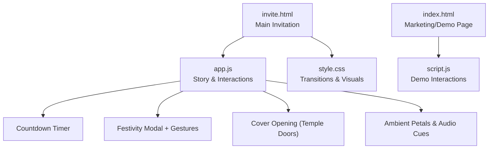

**Diagram sources**
- [invite.html:23-227](file://wedding/invite.html#L23-L227)
- [app.js:1312-1344](file://wedding/app.js#L1312-L1344)
- [app.js:900-915](file://wedding/app.js#L900-L915)
- [style.css:87-114](file://wedding/style.css#L87-L114)

**Section sources**
- [invite.html:23-227](file://wedding/invite.html#L23-L227)
- [index.html:444-618](file://wedding/index.html#L444-L618)

## Core Components
- Cover opening: Golden temple doors with a wax seal; clicking opens the invitation with a bell cue and door-parting animation.
- Hero and date card: Displays couple names, invocation text, date, time, and venue.
- Countdown timer: Live countdown to the wedding moment; shows a special message when the day arrives.
- Photo gallery: Editable mosaic where couples can add photos; guests view curated images.
- Festivities (interactive reveals): Four ritual gestures per event—rub off turmeric, trace henna heart, tap dhol, light diya—each revealing a poster or written card.
- Blessings and RSVP: Temple bell sound, team pick (bride/groom), WhatsApp RSVP link generation.
- Ambient effects: Mandala loader visuals, falling petals, and synthesized audio cues.

**Section sources**
- [invite.html:23-227](file://wedding/invite.html#L23-L227)
- [app.js:124-187](file://wedding/app.js#L124-L187)
- [app.js:900-915](file://wedding/app.js#L900-L915)
- [style.css:87-114](file://wedding/style.css#L87-L114)

## Architecture Overview
The story progression is orchestrated by app.js, which manages data, rendering, and interactions. invite.html defines the DOM structure and sections. style.css provides animations and visual themes. The demo page uses script.js to showcase similar interactions within a modal.

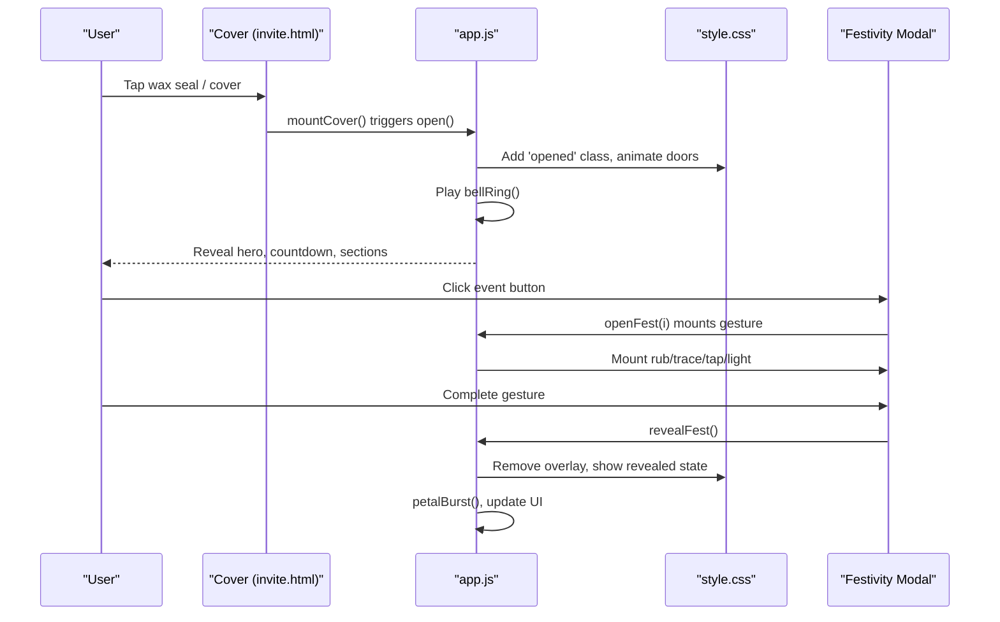

**Diagram sources**
- [invite.html:23-46](file://wedding/invite.html#L23-L46)
- [app.js:1312-1344](file://wedding/app.js#L1312-L1344)
- [app.js:367-429](file://wedding/app.js#L367-L429)
- [app.js:652-684](file://wedding/app.js#L652-L684)
- [style.css:87-114](file://wedding/style.css#L87-L114)

## Detailed Component Analysis

### Cover Opening (Wax Seal to Portal Transition)
- Behavior: The cover displays a wax seal and “tap to open.” On interaction, the doors part, a bell rings, and the body gains an ‘opened’ class to transition into the main content. Reduced motion respects prefers-reduced-motion.
- State: Tracks whether the cover has been opened to prevent re-triggering.
- Transitions: CSS classes drive door animations; JS toggles visibility and scroll behavior.

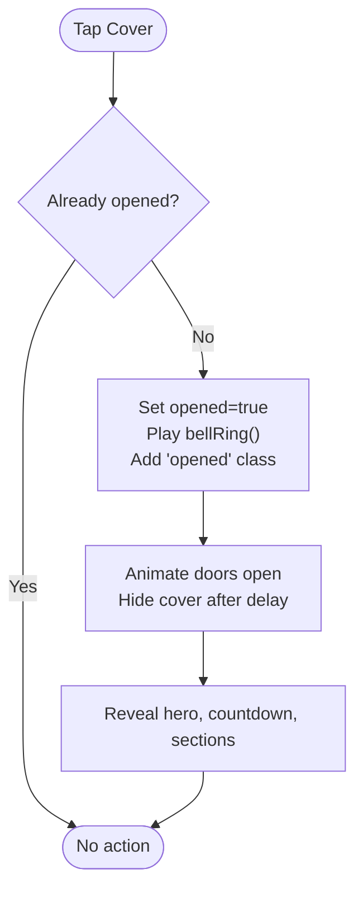

**Diagram sources**
- [app.js:1312-1344](file://wedding/app.js#L1312-L1344)
- [style.css:87-114](file://wedding/style.css#L87-L114)

**Section sources**
- [invite.html:23-46](file://wedding/invite.html#L23-L46)
- [app.js:1312-1344](file://wedding/app.js#L1312-L1344)

### Countdown Timer
- Behavior: Computes time until the wedding moment and updates days/hours/minutes/seconds every second. When the date arrives, it replaces the timer with a celebratory message.
- State: Uses the stored wedding date/time to compute timing.

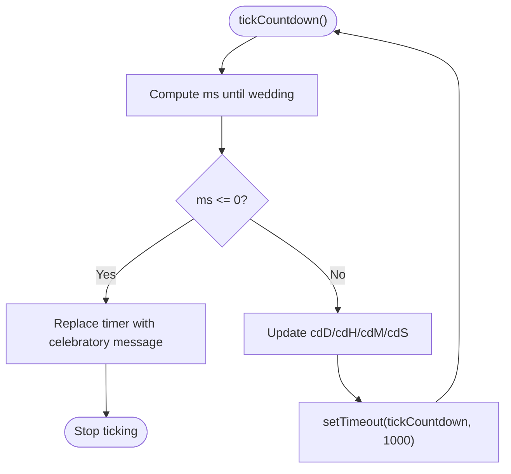

**Diagram sources**
- [app.js:900-915](file://wedding/app.js#L900-L915)

**Section sources**
- [invite.html:80-85](file://wedding/invite.html#L80-L85)
- [app.js:900-915](file://wedding/app.js#L900-L915)

### Photo Gallery
- Behavior: Renders editable photo slots; in edit mode, clicking a slot triggers image upload and compression. In viewing mode, photos are displayed.
- State: Stores up to five photos in DATA.photos; default placeholders exist.

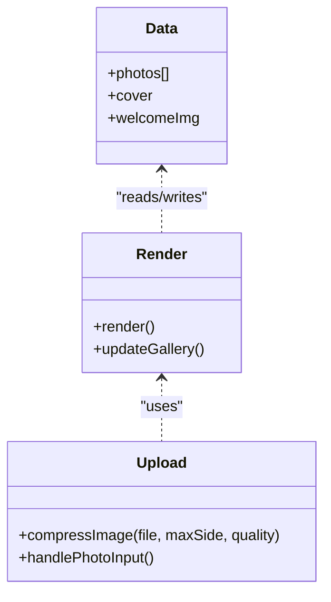

**Diagram sources**
- [app.js:226-232](file://wedding/app.js#L226-L232)
- [app.js:1131-1168](file://wedding/app.js#L1131-L1168)

**Section sources**
- [invite.html:113-128](file://wedding/invite.html#L113-L128)
- [app.js:226-232](file://wedding/app.js#L226-L232)
- [app.js:1131-1168](file://wedding/app.js#L1131-L1168)

### Festivities (Interactive Reveals)
- Modes: rub (turmeric rub-off), trace (henna heart tracing), tap (dhol tapping), light (diya lighting). Each mode mounts a specific gesture handler and reveals content upon completion.
- Flow: Event buttons open a modal; the appropriate gesture is mounted; completing the gesture removes the overlay, marks the event as revealed, and triggers celebration effects.

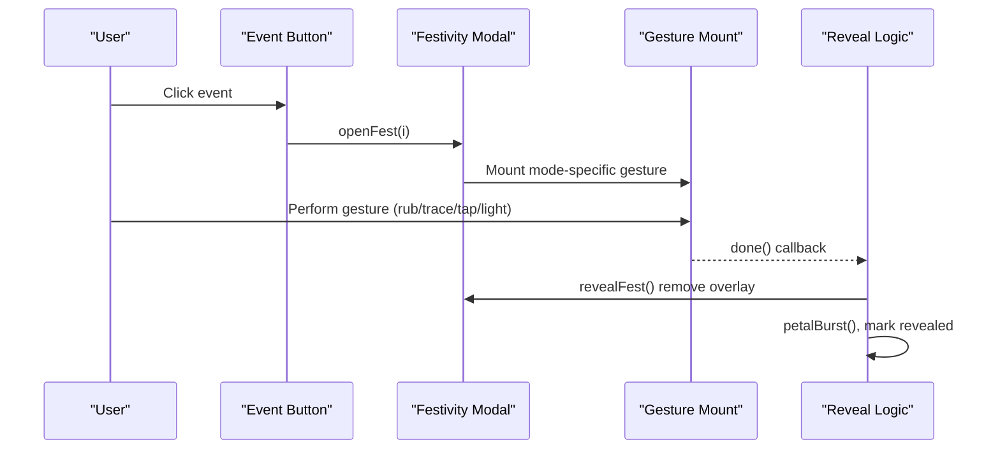

**Diagram sources**
- [app.js:367-429](file://wedding/app.js#L367-L429)
- [app.js:435-647](file://wedding/app.js#L435-L647)

**Section sources**
- [invite.html:130-139](file://wedding/invite.html#L130-L139)
- [app.js:124-187](file://wedding/app.js#L124-L187)
- [app.js:367-429](file://wedding/app.js#L367-L429)
- [app.js:435-647](file://wedding/app.js#L435-L647)

### Scratch Blessing (Rub-to-Reveal Canvas)
- Behavior: A canvas overlays a golden layer; pointer events erase pixels using destination-out compositing. When a threshold of transparency is reached, the underlying content is revealed with confetti.
- State: Tracks drawing state, progress, and completion to avoid repeated actions.

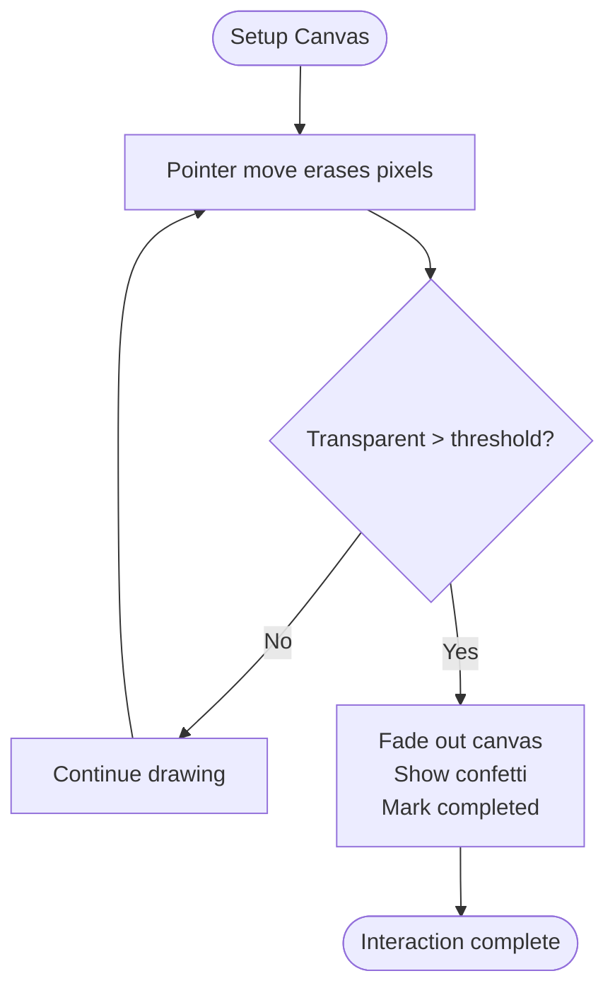

**Diagram sources**
- [script.js:103-218](file://wedding/script.js#L103-L218)

**Section sources**
- [index.html:169-190](file://wedding/index.html#L169-L190)
- [script.js:103-218](file://wedding/script.js#L103-L218)

### Hidden Moment (Scratch Card Reveal)
- Behavior: A scratch foil canvas hides a personalized message and image. Users scratch to uncover the hidden content.
- State: Tracks scratched area percentage to trigger reveal and hide the foil once complete.

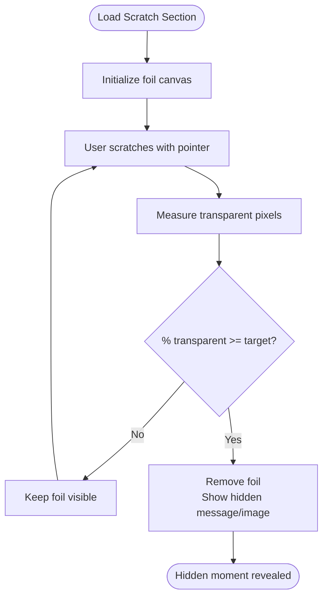

**Diagram sources**
- [3D Wedding Invitation Sample 2/invitation.html:167-187](file://3D Wedding Invitation Sample 2/invitation.html#L167-L187)

**Section sources**
- [3D Wedding Invitation Sample 2/invitation.html:167-187](file://3D Wedding Invitation Sample 2/invitation.html#L167-L187)

### Finale Gateway (Portal Transitions)
- Behavior: After completing key interactions (e.g., festivities), the system uses portal-like transitions (door-parting, overlay removal, petal bursts) to guide users to the next narrative segment.
- State: Uses CSS classes and JS flags to manage transition states and ensure one-time execution.

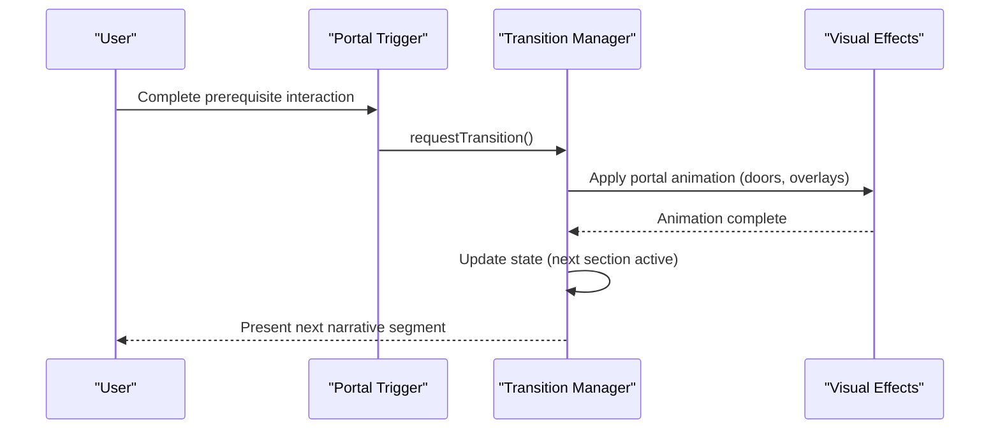

**Diagram sources**
- [app.js:1312-1344](file://wedding/app.js#L1312-L1344)
- [app.js:812-833](file://wedding/app.js#L812-L833)

**Section sources**
- [app.js:1312-1344](file://wedding/app.js#L1312-L1344)
- [app.js:812-833](file://wedding/app.js#L812-L833)

### Mandala Loader
- Behavior: Rotating mandala rings provide ambient loading visuals during transitions or while waiting for assets.
- State: Controlled via CSS animations; no complex JS state required.

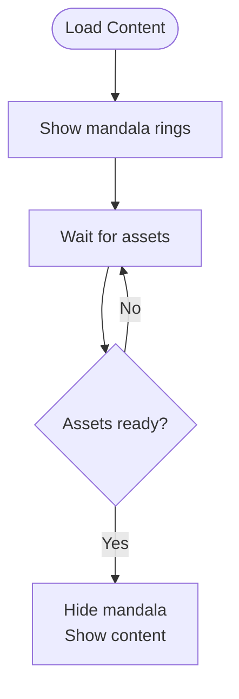

**Diagram sources**
- [style.css:87-114](file://wedding/style.css#L87-L114)

**Section sources**
- [style.css:87-114](file://wedding/style.css#L87-L114)

### Audio Cues
- Behavior: Synthesized sounds (bell ring, thump) enhance interactions without external audio files. AudioContext is initialized lazily and resumed on user gestures.
- State: Tracks audio context state and resumes when needed.

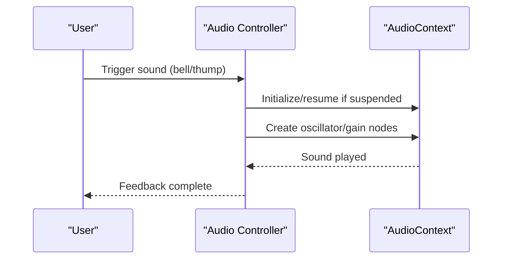

**Diagram sources**
- [app.js:652-684](file://wedding/app.js#L652-L684)

**Section sources**
- [app.js:652-684](file://wedding/app.js#L652-L684)

## Dependency Analysis
- invite.html depends on app.js for logic and style.css for visuals.
- app.js orchestrates countdown, festivity modal, cover opening, ambient effects, and audio.
- index.html and script.js provide a demo experience mirroring core interactions.

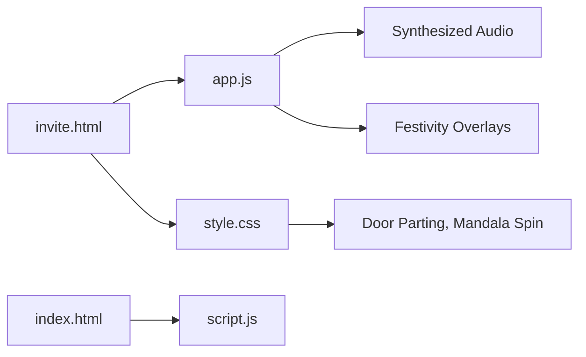

**Diagram sources**
- [invite.html:23-227](file://wedding/invite.html#L23-L227)
- [app.js:1312-1344](file://wedding/app.js#L1312-L1344)
- [style.css:87-114](file://wedding/style.css#L87-L114)
- [index.html:444-618](file://wedding/index.html#L444-L618)
- [script.js:711-779](file://wedding/script.js#L711-L779)

**Section sources**
- [invite.html:23-227](file://wedding/invite.html#L23-L227)
- [app.js:1312-1344](file://wedding/app.js#L1312-L1344)
- [style.css:87-114](file://wedding/style.css#L87-L114)
- [index.html:444-618](file://wedding/index.html#L444-L618)
- [script.js:711-779](file://wedding/script.js#L711-L779)

## Performance Considerations
- Canvas operations sample pixels at intervals to reduce overhead during rub-to-reveal and scratch interactions.
- Image compression occurs in-browser before storage or sharing to keep links manageable.
- IntersectionObserver is used for reveal animations to minimize unnecessary computations.
- Reduced motion preferences are respected to disable heavy animations when requested.

[No sources needed since this section provides general guidance]

## Troubleshooting Guide
- Cover does not open: Ensure the cover element exists and is not hidden prematurely; check for reduced motion settings.
- Countdown not updating: Verify wedding date/time parsing and that the countdown container exists.
- Festivity gestures not triggering: Confirm gesture mount functions are called and overlay elements are present.
- Audio not playing: Ensure AudioContext is resumed after a user gesture; check browser permissions.

**Section sources**
- [app.js:1312-1344](file://wedding/app.js#L1312-L1344)
- [app.js:900-915](file://wedding/app.js#L900-L915)
- [app.js:652-684](file://wedding/app.js#L652-L684)

## Conclusion
The story progression system combines structured narrative sections with rich interactivity to create an engaging wedding invitation experience. State management ensures smooth transitions and context maintenance, while modular components allow customization and extension. By leveraging canvas interactions, synthesized audio, and CSS-driven animations, the system delivers a cohesive journey from the wax seal opening to the finale gateway.

[No sources needed since this section summarizes without analyzing specific files]

## Appendices

### Customization Examples
- Customize story flow: Modify event order and modes in DATA.events; adjust default posters and welcome imagery.
- Add new narrative sections: Insert new DOM sections in invite.html and wire up reveal logic in app.js using IntersectionObserver.
- Modify transition animations: Adjust CSS classes and keyframes in style.css; tweak JS timing in mountCover and reveal functions.
- Implement conditional content: Use user interactions (e.g., side pick, gesture completion) to toggle visibility or update messages dynamically.

**Section sources**
- [app.js:124-187](file://wedding/app.js#L124-L187)
- [app.js:367-429](file://wedding/app.js#L367-L429)
- [style.css:87-114](file://wedding/style.css#L87-L114)
- [invite.html:130-139](file://wedding/invite.html#L130-L139)