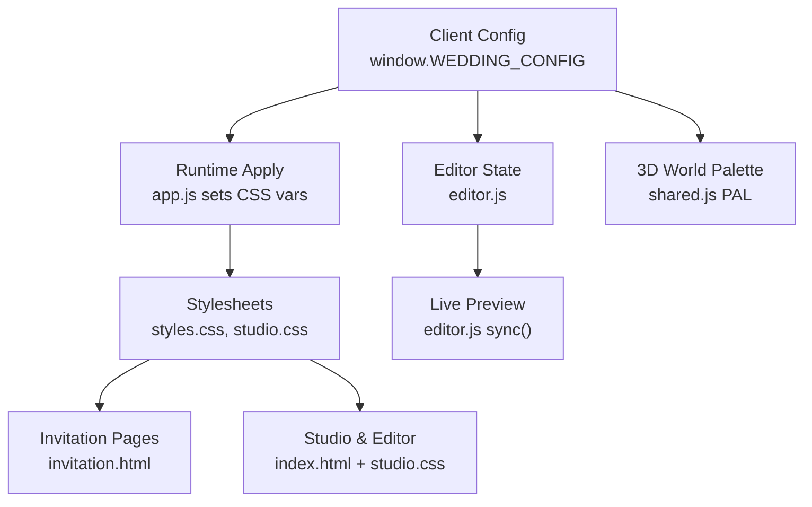
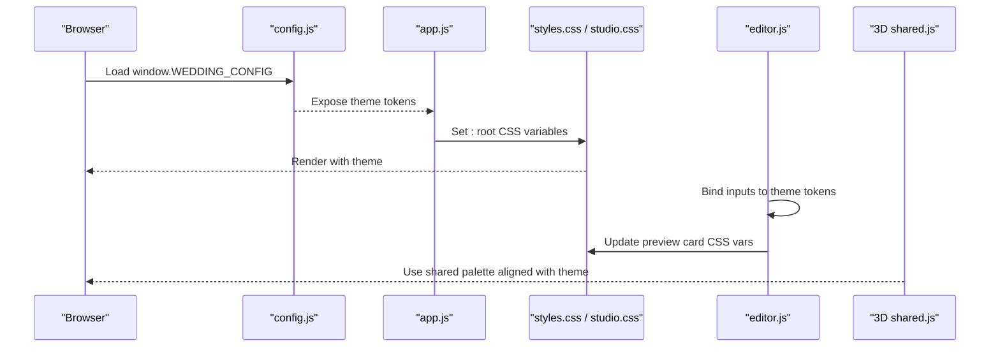
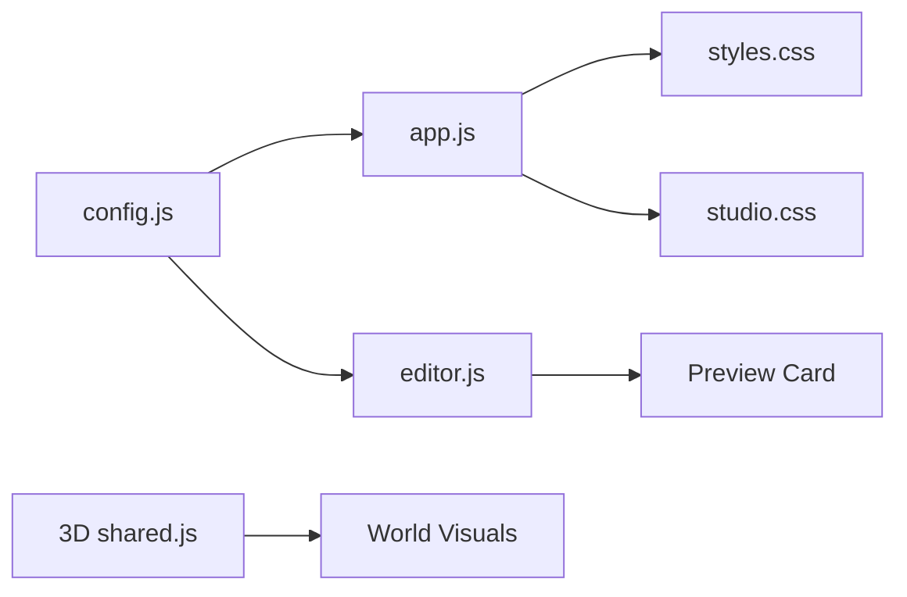

# Theme & Customization System

<cite>
**Referenced Files in This Document**
- [config.js](file://3D Wedding Invitation Sample 2/config.js)
- [styles.css](file://3D Wedding Invitation Sample 2/styles.css)
- [studio.css](file://3D Wedding Invitation Sample 2/studio.css)
- [app.js](file://3D Wedding Invitation Sample 2/app.js)
- [editor.js](file://3D Wedding Invitation Sample 2/editor.js)
- [invitation.html](file://3D Wedding Invitation Sample 2/invitation.html)
- [index.html](file://3D Wedding Invitation Sample 2/index.html)
- [shared.js](file://3D Wedding Invitation Sample 2/3d-world-source/src/wedding/shared.js)
</cite>

## Table of Contents
1. Introduction
2. Project Structure
3. Core Components
4. Architecture Overview
5. Detailed Component Analysis
6. Dependency Analysis
7. Performance Considerations
8. Troubleshooting Guide
9. Conclusion
10. Appendices

## Introduction
This document explains the theme and customization system that powers dynamic styling across the wedding invitation experience. It covers CSS custom properties, color palette management, typography, responsive design patterns, and how themes are applied to the main invitation, editor interface, and 3D world elements. It also documents the configuration structure in config.js, available customization options, and best practices for creating new themes with practical examples for colors, fonts, spacing, and visual effects while maintaining consistency.

## Project Structure
The theme system is centered around a single client configuration object and a set of CSS custom properties that propagate through the UI and runtime logic:
- Client configuration defines content and theme tokens.
- The engine applies theme tokens to CSS variables at runtime.
- Stylesheets consume those variables for colors, typography, glass effects, and responsive behavior.
- The editor provides a live preview and presets to shape the theme without code.
- The 3D world uses a shared palette aligned with the invitation’s royal aesthetic.

**Diagram sources**
- [config.js:6-123](file://3D Wedding Invitation Sample 2/config.js#L6-L123)
- [app.js:28-37](file://3D Wedding Invitation Sample 2/app.js#L28-L37)
- [styles.css:6-20](file://3D Wedding Invitation Sample 2/styles.css#L6-L20)
- [studio.css:4-11](file://3D Wedding Invitation Sample 2/studio.css#L4-L11)
- [editor.js:198-215](file://3D Wedding Invitation Sample 2/editor.js#L198-L215)
- [shared.js:1-26](file://3D Wedding Invitation Sample 2/3d-world-source/src/wedding/shared.js#L1-L26)

**Section sources**
- [config.js:6-123](file://3D Wedding Invitation Sample 2/config.js#L6-L123)
- [styles.css:6-20](file://3D Wedding Invitation Sample 2/styles.css#L6-L20)
- [studio.css:4-11](file://3D Wedding Invitation Sample 2/studio.css#L4-L11)
- [app.js:28-37](file://3D Wedding Invitation Sample 2/app.js#L28-L37)
- [editor.js:198-215](file://3D Wedding Invitation Sample 2/editor.js#L198-L215)
- [shared.js:1-26](file://3D Wedding Invitation Sample 2/3d-world-source/src/wedding/shared.js#L1-L26)

## Core Components
- Configuration object (config.js): Holds couple details, events, venue, RSVP, films, frames, sanctum text, and the theme token map.
- Runtime theme application (app.js): Reads window.WEDDING_CONFIG.theme and writes CSS custom properties on :root.
- Stylesheets (styles.css, studio.css): Consume CSS variables for colors, typography, glass effects, and responsive layouts.
- Editor (editor.js): Binds form inputs to theme tokens, offers presets, and updates a live preview card with theme variables.
- 3D world palette (shared.js): Provides a consistent color palette aligned with the invitation’s royal theme.

Key responsibilities:
- Centralize all customizable values in one place (config.js).
- Propagate theme tokens into CSS variables early in load so styles can react immediately.
- Provide an editor-driven workflow to modify and preview changes before publishing.
- Keep 3D visuals coordinated via a shared palette.

**Section sources**
- [config.js:6-123](file://3D Wedding Invitation Sample 2/config.js#L6-L123)
- [app.js:28-37](file://3D Wedding Invitation Sample 2/app.js#L28-L37)
- [styles.css:6-20](file://3D Wedding Invitation Sample 2/styles.css#L6-L20)
- [studio.css:4-11](file://3D Wedding Invitation Sample 2/studio.css#L4-L11)
- [editor.js:198-215](file://3D Wedding Invitation Sample 2/editor.js#L198-L215)
- [shared.js:1-26](file://3D Wedding Invitation Sample 2/3d-world-source/src/wedding/shared.js#L1-L26)

## Architecture Overview
The theme architecture follows a simple, robust flow:
- A single source of truth (window.WEDDING_CONFIG) contains theme tokens.
- On page load, app.js maps these tokens to CSS custom properties on :root.
- All components read from CSS variables, ensuring consistent appearance.
- The editor modifies the same tokens and reflects them instantly in a preview card.
- The 3D world references a shared palette that mirrors the invitation’s color language.

**Diagram sources**
- [config.js:6-123](file://3D Wedding Invitation Sample 2/config.js#L6-L123)
- [app.js:28-37](file://3D Wedding Invitation Sample 2/app.js#L28-L37)
- [styles.css:6-20](file://3D Wedding Invitation Sample 2/styles.css#L6-L20)
- [studio.css:4-11](file://3D Wedding Invitation Sample 2/studio.css#L4-L11)
- [editor.js:198-215](file://3D Wedding Invitation Sample 2/editor.js#L198-L215)
- [shared.js:1-26](file://3D Wedding Invitation Sample 2/3d-world-source/src/wedding/shared.js#L1-L26)

## Detailed Component Analysis

### CSS Custom Properties Architecture
- Root variables define the brand palette, typography, and glass effects used throughout the invitation.
- Variables include primary maroon, deep maroon, gold, soft gold, ivory background, ink color, and font stacks.
- Glass effects use gradients and shadows derived from theme colors for consistent depth and translucency.
- Responsive utilities rely on viewport units and clamp-based sizing to adapt across devices.

Practical implications:
- Changing a single variable updates every component that consumes it.
- Typography scales fluidly using clamp and relative units.
- Visual effects like foil text and glass cards inherit theme colors automatically.

**Section sources**
- [styles.css:6-20](file://3D Wedding Invitation Sample 2/styles.css#L6-L20)
- [styles.css:52-68](file://3D Wedding Invitation Sample 2/styles.css#L52-L68)
- [styles.css:348-379](file://3D Wedding Invitation Sample 2/styles.css#L348-L379)

### Color Palette Management
- Theme tokens in config.js define maroon, maroonDeep, gold, goldSoft, ivory, and inkOnIvory.
- app.js reads these tokens and assigns them to CSS variables at runtime, enabling dynamic theme switching.
- The editor binds inputs to these tokens and updates a live preview card by setting CSS variables on the preview container.
- Presets provide curated palettes to quickly switch the entire look and feel.

Best practices:
- Always update tokens in config.js or via the editor; avoid hardcoding colors in components.
- Maintain contrast ratios between ink and background for readability.
- Use gold accents sparingly for emphasis.

**Section sources**
- [config.js:87-95](file://3D Wedding Invitation Sample 2/config.js#L87-L95)
- [app.js:28-37](file://3D Wedding Invitation Sample 2/app.js#L28-L37)
- [editor.js:198-215](file://3D Wedding Invitation Sample 2/editor.js#L198-L215)
- [editor.js:394-401](file://3D Wedding Invitation Sample 2/editor.js#L394-L401)

### Typography System
- Display and body typefaces are defined as CSS variables for headings and body text.
- A Telugu serif variant is included for regional text support.
- Names and section titles use display typography with letter-spacing and uppercase styling for elegance.
- Fluid sizing via clamp ensures legibility across screen sizes.

Guidelines:
- Keep line-height comfortable for long passages.
- Use display type for short, impactful text (titles, monograms).
- Reserve body type for readable paragraphs and event descriptions.

**Section sources**
- [styles.css:6-20](file://3D Wedding Invitation Sample 2/styles.css#L6-L20)
- [styles.css:384-435](file://3D Wedding Invitation Sample 2/styles.css#L384-L435)
- [styles.css:753-779](file://3D Wedding Invitation Sample 2/styles.css#L753-L779)

### Responsive Design Patterns
- Mobile-first layout with flexible grids and clamp-based sizing.
- Sticky hero and sanctum sections use viewport units to maintain stable heights across mobile browser chrome.
- Side notes appear only on wide screens with aspect-ratio checks.
- Reduced motion media queries disable animations for accessibility.

Patterns to follow:
- Use clamp for font sizes and spacing to scale smoothly.
- Avoid fixed heights; prefer vh-based calculations where necessary.
- Test sticky sections on iOS Safari due to URL bar behavior.

**Section sources**
- [styles.css:184-294](file://3D Wedding Invitation Sample 2/styles.css#L184-L294)
- [styles.css:619-736](file://3D Wedding Invitation Sample 2/styles.css#L619-L736)
- [styles.css:458-462](file://3D Wedding Invitation Sample 2/studio.css#L458-L462)

### Theme Application Across Components
- Main invitation: app.js applies theme tokens to :root; styles.css consumes them for backgrounds, text, borders, and effects.
- Editor interface: studio.css defines its own dark theme variables; editor.js updates a preview card with current theme tokens.
- 3D world: shared.js exports a palette aligned with the invitation’s royal colors; ensure assets and lighting match the chosen palette.

Consistency tips:
- Keep theme tokens centralized; do not duplicate colors in multiple places.
- When adding new components, reference existing CSS variables rather than introducing new ones.
- Validate contrast and accessibility when swapping palettes.

**Section sources**
- [app.js:28-37](file://3D Wedding Invitation Sample 2/app.js#L28-L37)
- [styles.css:6-20](file://3D Wedding Invitation Sample 2/styles.css#L6-L20)
- [studio.css:4-11](file://3D Wedding Invitation Sample 2/studio.css#L4-L11)
- [editor.js:394-401](file://3D Wedding Invitation Sample 2/editor.js#L394-L401)
- [shared.js:1-26](file://3D Wedding Invitation Sample 2/3d-world-source/src/wedding/shared.js#L1-L26)

### Configuration Structure and Options
The configuration object includes:
- Couple details: names, full names, monogram, tagline, hashtag.
- Wedding moment: ISO date, display date, muhurat time.
- Events: ordered list with name, icon, date, time, venue, description, accent color.
- Venue: name, address, maps query.
- RSVP: form URL and deadline.
- Scratch message: heading and message.
- Frames and sanctum: frame counts, paths, prefixes, extensions, and textual hints.
- Films: array of video entries with eyebrow, line, src, poster.
- Theme: maroon, maroonDeep, gold, goldSoft, ivory, inkOnIvory.

Editing guidance:
- Change theme tokens to rebrand the invitation globally.
- Adjust events to reflect actual schedule and venues.
- Update films and frames to personalize the cinematic experience.
- Derive fields like hashtag and city are auto-computed if missing.

**Section sources**
- [config.js:6-123](file://3D Wedding Invitation Sample 2/config.js#L6-L123)
- [config.js:155-163](file://3D Wedding Invitation Sample 2/config.js#L155-L163)

### Editor Workflow and Live Preview
- Inputs bind to theme tokens and other fields; changes persist to localStorage draft.
- Presets apply complete palettes instantly.
- Live preview updates CSS variables on the preview card to mirror the invitation’s look.
- Validation helpers warn about local-only video sources and recommend durations.

Workflow steps:
- Open the editor and select a preset or adjust individual tokens.
- Review the live preview card for accurate representation.
- Export config.js or JSON brief for handoff.
- Publish via the studio flow to generate a shareable link.

**Section sources**
- [editor.js:198-215](file://3D Wedding Invitation Sample 2/editor.js#L198-L215)
- [editor.js:394-401](file://3D Wedding Invitation Sample 2/editor.js#L394-L401)
- [editor.js:473-487](file://3D Wedding Invitation Sample 2/editor.js#L473-L487)
- [editor.js:502-516](file://3D Wedding Invitation Sample 2/editor.js#L502-L516)

### 3D World Integration
- The 3D world uses a shared palette that aligns with the invitation’s royal theme.
- Ensure environment lighting, materials, and props reflect the chosen palette.
- Coordinate transitions between invitation and world to maintain visual continuity.

Recommendations:
- Map invitation theme tokens to 3D palette equivalents.
- Test color perception under different lighting conditions in the world.
- Keep asset naming consistent with theme families (e.g., gold, marigold, rose).

**Section sources**
- [shared.js:1-26](file://3D Wedding Invitation Sample 2/3d-world-source/src/wedding/shared.js#L1-L26)

## Dependency Analysis
Theme dependencies flow from configuration to runtime application to styles and components:
- config.js defines tokens consumed by app.js.
- app.js writes CSS variables used by styles.css and studio.css.
- editor.js binds user input to tokens and updates preview variables.
- 3D world shares a palette aligned with the invitation theme.

**Diagram sources**
- [config.js:6-123](file://3D Wedding Invitation Sample 2/config.js#L6-L123)
- [app.js:28-37](file://3D Wedding Invitation Sample 2/app.js#L28-L37)
- [styles.css:6-20](file://3D Wedding Invitation Sample 2/styles.css#L6-L20)
- [studio.css:4-11](file://3D Wedding Invitation Sample 2/studio.css#L4-L11)
- [editor.js:198-215](file://3D Wedding Invitation Sample 2/editor.js#L198-L215)
- [shared.js:1-26](file://3D Wedding Invitation Sample 2/3d-world-source/src/wedding/shared.js#L1-L26)

**Section sources**
- [config.js:6-123](file://3D Wedding Invitation Sample 2/config.js#L6-L123)
- [app.js:28-37](file://3D Wedding Invitation Sample 2/app.js#L28-L37)
- [styles.css:6-20](file://3D Wedding Invitation Sample 2/styles.css#L6-L20)
- [studio.css:4-11](file://3D Wedding Invitation Sample 2/studio.css#L4-L11)
- [editor.js:198-215](file://3D Wedding Invitation Sample 2/editor.js#L198-L215)
- [shared.js:1-26](file://3D Wedding Invitation Sample 2/3d-world-source/src/wedding/shared.js#L1-L26)

## Performance Considerations
- Prefer CSS variables over inline styles for performance and maintainability.
- Use clamp and relative units to reduce layout recalculations.
- Limit heavy effects (glass, shadows) on low-end devices; leverage reduced motion settings.
- Preload critical assets and defer non-essential scripts to keep initial paint fast.
- In the 3D world, align palette choices to minimize texture complexity and improve rendering speed.

[No sources needed since this section provides general guidance]

## Troubleshooting Guide
Common issues and resolutions:
- Colors not updating: Ensure app.js runs after config.js and that theme tokens exist in window.WEDDING_CONFIG.theme.
- Fonts not loading: Verify Google Fonts links are present and preconnect tags are included.
- Editor preview mismatch: Confirm editor.js sync() updates preview card variables and that CSS selectors target the correct elements.
- 3D world looks off-theme: Align world palette with invitation tokens; check lighting and material colors.
- Accessibility problems: Check contrast ratios and ensure reduced motion is respected.

Validation checklist:
- Theme tokens present in config.js.
- CSS variables set on :root during runtime.
- Components reference variables consistently.
- Editor bindings active and saving drafts.
- 3D world palette matches invitation theme.

**Section sources**
- [config.js:87-95](file://3D Wedding Invitation Sample 2/config.js#L87-L95)
- [app.js:28-37](file://3D Wedding Invitation Sample 2/app.js#L28-L37)
- [editor.js:198-215](file://3D Wedding Invitation Sample 2/editor.js#L198-L215)
- [shared.js:1-26](file://3D Wedding Invitation Sample 2/3d-world-source/src/wedding/shared.js#L1-L26)

## Conclusion
The theme and customization system centers on a single configuration object and CSS custom properties, enabling consistent, dynamic styling across the invitation, editor, and 3D world. By editing tokens in config.js or using the editor’s presets, you can change colors, fonts, spacing, and effects while preserving coherence. Follow the best practices outlined here to maintain accessibility, performance, and visual harmony throughout the experience.

[No sources needed since this section summarizes without analyzing specific files]

## Appendices

### Practical Examples
- Modify colors:
  - Change theme tokens in config.js (maroon, gold, ivory, inkOnIvory).
  - Use editor presets to switch palettes quickly.
  - Verify updates in both invitation and editor preview.
- Adjust typography:
  - Update font stacks in CSS variables for display and body.
  - Use clamp for fluid sizing and test across devices.
- Tweak spacing:
  - Adjust padding and margins using relative units and clamp.
  - Ensure sticky sections remain stable on mobile browsers.
- Enhance visual effects:
  - Refine glass gradients and shadows based on theme colors.
  - Use foil text sparingly for emphasis.
  - Validate contrast and accessibility.

[No sources needed since this section provides general guidance]