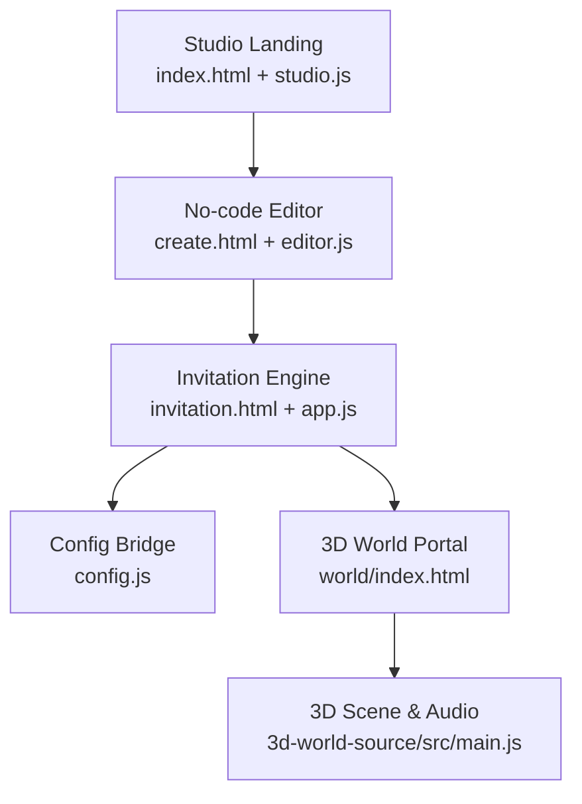
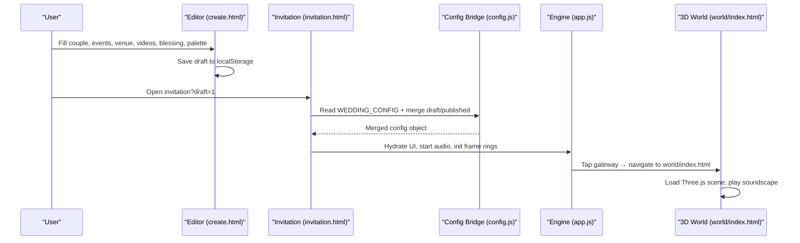
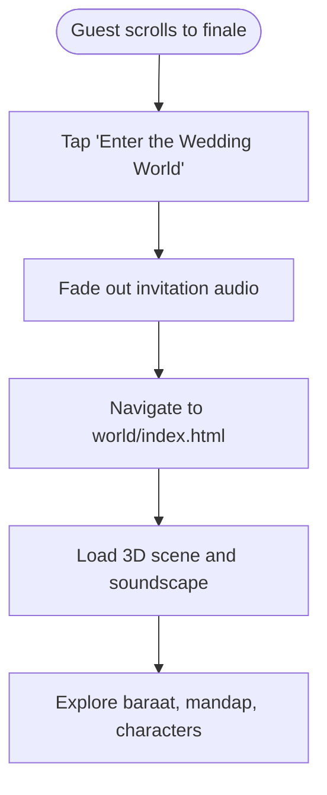
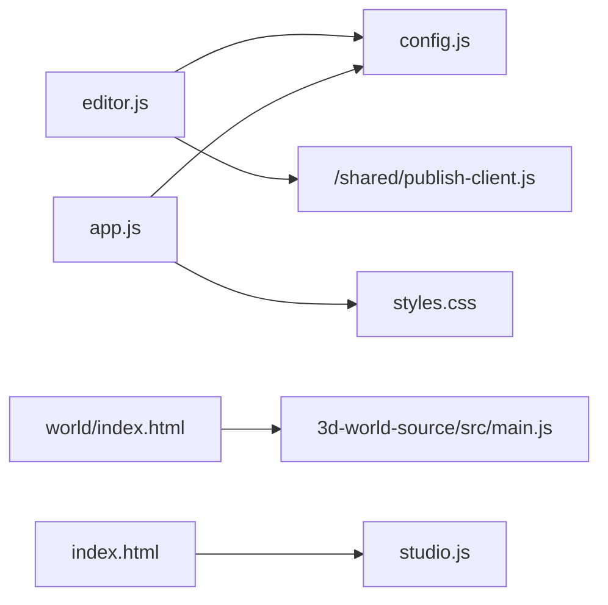

# Wedding Invitation Builder

<cite>
**Referenced Files in This Document**
- [README.md](file://3D Wedding Invitation Sample 2/README.md)
- [index.html](file://3D Wedding Invitation Sample 2/index.html)
- [studio.js](file://3D Wedding Invitation Sample 2/studio.js)
- [create.html](file://3D Wedding Invitation Sample 2/create.html)
- [editor.js](file://3D Wedding Invitation Sample 2/editor.js)
- [config.js](file://3D Wedding Invitation Sample 2/config.js)
- [invitation.html](file://3D Wedding Invitation Sample 2/invitation.html)
- [app.js](file://3D Wedding Invitation Sample 2/app.js)
- [world/index.html](file://3D Wedding Invitation Sample 2/world/index.html)
- [3d-world-source/src/main.js](file://3D Wedding Invitation Sample 2/3d-world-source/src/main.js)
</cite>

## Table of Contents
1. [Introduction](#introduction)
2. [Project Structure](#project-structure)
3. [Core Components](#core-components)
4. [Architecture Overview](#architecture-overview)
5. [Detailed Component Analysis](#detailed-component-analysis)
6. [Dependency Analysis](#dependency-analysis)
7. [Performance Considerations](#performance-considerations)
8. [Troubleshooting Guide](#troubleshooting-guide)
9. [Conclusion](#conclusion)

## Introduction
This document explains the wedding invitation builder system: a no-code editor that lets clients create custom, scroll-driven cinematic invitations with live preview, theme customization, and export mechanisms. It also documents the studio landing page, the relationship between the 2D editor and the 3D world portal, and provides practical examples for customization and content management. Finally, it includes troubleshooting guidance and performance optimization tips.

The experience is mobile-first and consists of:
- A studio landing page that showcases the product and links to the demo and editor.
- A no-code editor where users configure couple details, events, venue, RSVP, films, blessing text, and palette.
- A scroll-cinema invitation with an adaptive frame scrub, ambient petals, scratch-to-reveal blessing, countdown, event cards, hidden moment film, venue/RSVP, and a gateway into a separately loaded 3D world.
- An independent 3D wedding world (Three.js) that loads only when guests choose to enter.

**Section sources**
- [README.md:1-115](file://3D Wedding Invitation Sample 2/README.md#L1-L115)

## Project Structure
At a high level, the project contains:
- Studio landing page and interactions
- No-code editor with live preview and export
- Invitation engine powering the scroll-cinema experience
- Configuration module that merges defaults, drafts, and published overrides
- Independent 3D world build served under world/

**Diagram sources**
- [index.html:1-402](file://3D Wedding Invitation Sample 2/index.html#L1-L402)
- [studio.js:1-146](file://3D Wedding Invitation Sample 2/studio.js#L1-L146)
- [create.html:1-411](file://3D Wedding Invitation Sample 2/create.html#L1-L411)
- [editor.js:1-655](file://3D Wedding Invitation Sample 2/editor.js#L1-L655)
- [invitation.html:1-326](file://3D Wedding Invitation Sample 2/invitation.html#L1-L326)
- [app.js:1-800](file://3D Wedding Invitation Sample 2/app.js#L1-L800)
- [config.js:1-212](file://3D Wedding Invitation Sample 2/config.js#L1-L212)
- [world/index.html:1-283](file://3D Wedding Invitation Sample 2/world/index.html#L1-L283)
- [3d-world-source/src/main.js:1-200](file://3D Wedding Invitation Sample 2/3d-world-source/src/main.js#L1-L200)

**Section sources**
- [README.md:8-22](file://3D Wedding Invitation Sample 2/README.md#L8-L22)

## Core Components
- Studio landing page: introduces the product, shows a phone mockup, and links to the live demo and editor.
- No-code editor: step-by-step form with live preview, theme presets, event management, video clips, blessing text, and export options (download config.js or JSON brief).
- Invitation engine: scroll-scrubbed origami cinema, ambient petals, scratch card, countdown, event cards, hidden moment film, venue/RSVP, and portal handoff to the 3D world.
- Config bridge: merges default configuration with editor drafts or published overrides; exposes defaults for reset behavior and derives fields like hashtag and city.
- 3D world: separate Vite-built scene with characters, environment, post-processing, and soundscape; loaded only after user activation.

**Section sources**
- [index.html:48-117](file://3D Wedding Invitation Sample 2/index.html#L48-L117)
- [create.html:51-305](file://3D Wedding Invitation Sample 2/create.html#L51-L305)
- [editor.js:27-655](file://3D Wedding Invitation Sample 2/editor.js#L27-L655)
- [invitation.html:66-326](file://3D Wedding Invitation Sample 2/invitation.html#L66-L326)
- [app.js:1-800](file://3D Wedding Invitation Sample 2/app.js#L1-L800)
- [config.js:6-212](file://3D Wedding Invitation Sample 2/config.js#L6-L212)
- [world/index.html:1-283](file://3D Wedding Invitation Sample 2/world/index.html#L1-L283)
- [3d-world-source/src/main.js:1-200](file://3D Wedding Invitation Sample 2/3d-world-source/src/main.js#L1-L200)

## Architecture Overview
The system separates authoring from viewing:
- The editor persists drafts locally and can publish via a server flow gated by an activation code.
- The invitation reads configuration from config.js, then merges any draft or published override based on URL parameters or hydration context.
- The 3D world is independent and only loaded when the guest taps the gateway link at the end of the invitation.

**Diagram sources**
- [create.html:51-305](file://3D Wedding Invitation Sample 2/create.html#L51-L305)
- [editor.js:73-655](file://3D Wedding Invitation Sample 2/editor.js#L73-L655)
- [config.js:138-212](file://3D Wedding Invitation Sample 2/config.js#L138-L212)
- [invitation.html:66-326](file://3D Wedding Invitation Sample 2/invitation.html#L66-L326)
- [app.js:1-800](file://3D Wedding Invitation Sample 2/app.js#L1-L800)
- [world/index.html:200-283](file://3D Wedding Invitation Sample 2/world/index.html#L200-L283)

## Detailed Component Analysis

### Studio Landing Page
- Provides branding, showcase, pricing, FAQ, and calls to action.
- Phone mockup demonstrates the invitation’s look and feel without loading heavy assets.
- Links to the live demo and editor.

Practical usage:
- Update brand details in the script block for name, tagline, email, WhatsApp, Instagram.
- Use “Create yours” to open the editor.

**Section sources**
- [index.html:48-117](file://3D Wedding Invitation Sample 2/index.html#L48-L117)
- [index.html:119-155](file://3D Wedding Invitation Sample 2/index.html#L119-L155)
- [index.html:227-311](file://3D Wedding Invitation Sample 2/index.html#L227-L311)
- [index.html:329-377](file://3D Wedding Invitation Sample 2/index.html#L329-L377)
- [studio.js:5-31](file://3D Wedding Invitation Sample 2/studio.js#L5-L31)

### No-code Editor
- Step-based workflow: Couple, Functions, Venue & RSVP, Videos, Blessing, Palette, Launch.
- Live preview updates per step; contextual scenes show only relevant parts.
- Theme presets and color swatches; dynamic event list with add/move/reorder/delete.
- Video clip management supports direct URLs or local file previews (preview-only; not shared).
- Export options: download generated config.js or JSON brief; publish flow gated by activation code.

Customization examples:
- Change couple names, monogram, tagline, muhurat date/time/timezone.
- Add multiple functions with icons, dates, venues, lines, and accent colors.
- Set venue name/address, maps query, RSVP form URL or deadline.
- Replace film bands with hosted MP4/WebM URLs; optional local preview.
- Write secret blessing and hidden-moment hints.
- Apply preset palettes or fine-tune six theme colors.

Export mechanisms:
- Download config.js to drop into the project root.
- Download JSON brief for studio handoff.
- Publish via activation code to receive a permanent link.

**Section sources**
- [create.html:51-305](file://3D Wedding Invitation Sample 2/create.html#L51-L305)
- [editor.js:27-655](file://3D Wedding Invitation Sample 2/editor.js#L27-L655)

### Invitation Engine (Scroll-driven Cinematic Experience)
Key features:
- Scroll-scrubbed hero canvas using low-res frames first, then upgrading to hi-res frames when motion calms.
- Adaptive ring buffers for frame streaming with eviction to bound memory.
- Ambient petal particle system with pre-rendered sprites and gust effects.
- Scratch-to-reveal blessing with foil texture, haptics, bells, and petal bursts.
- Live countdown to muhurat.
- Event cards rendered from config.
- Hidden moment (sanctum) scroll-unlocked film with progress and bell reveal.
- Venue section with map links and RSVP modal (Google Form embed or built-in form).
- Film bands with lazy loading and captions.
- Final gateway to the 3D world with smooth transition and audio handoff.

Data flow:
- Reads window.WEDDING_CONFIG (merged by config bridge).
- Hydrates DOM elements with couple, wedding, venue, events, scratch, sanctum, and films data.
- Initializes audio context on user gesture; manages mute state and background score.
- Uses IntersectionObserver to activate components near viewport.

**Section sources**
- [invitation.html:66-326](file://3D Wedding Invitation Sample 2/invitation.html#L66-L326)
- [app.js:1-800](file://3D Wedding Invitation Sample 2/app.js#L1-L800)
- [app.js:801-1600](file://3D Wedding Invitation Sample 2/app.js#L801-L1600)

### Config Bridge
Responsibilities:
- Exposes clean defaults for editor reset.
- Derives missing fields (hashtag, city, short date) from provided inputs.
- Merges base config with editor drafts (?draft=1) or published content (via DD_HYDRATE).
- Prevents accidental persistence of guest-facing overrides to device storage.

Integration points:
- Editor uses WEDDING_DEFAULTS to reset to demo baseline.
- Invitation engine consumes merged config for all UI and behaviors.
- 3D world reads couple names from URL parameters or draft if explicitly requested.

**Section sources**
- [config.js:6-123](file://3D Wedding Invitation Sample 2/config.js#L6-L123)
- [config.js:138-212](file://3D Wedding Invitation Sample 2/config.js#L138-L212)
- [editor.js:23-49](file://3D Wedding Invitation Sample 2/editor.js#L23-L49)

### 3D World Integration
- The invitation ends with a CSS-only gateway link to world/index.html.
- Navigation occurs in the same tab; the invitation fades and pauses its audio before navigation.
- The 3D world loads only upon activation, keeping the invitation lightweight.
- The world reads couple names from URL parameters or draft when explicitly requested, avoiding cross-page leakage.

**Diagram sources**
- [invitation.html:255-285](file://3D Wedding Invitation Sample 2/invitation.html#L255-L285)
- [world/index.html:200-283](file://3D Wedding Invitation Sample 2/world/index.html#L200-L283)
- [3d-world-source/src/main.js:1-200](file://3D Wedding Invitation Sample 2/3d-world-source/src/main.js#L1-L200)

**Section sources**
- [invitation.html:255-285](file://3D Wedding Invitation Sample 2/invitation.html#L255-L285)
- [world/index.html:200-283](file://3D Wedding Invitation Sample 2/world/index.html#L200-L283)
- [3d-world-source/src/main.js:1-200](file://3D Wedding Invitation Sample 2/3d-world-source/src/main.js#L1-L200)

## Dependency Analysis
- Editor depends on config.js for defaults and on shared publishing client for activation flow.
- Invitation engine depends on config.js for runtime configuration and on styles.css for presentation.
- 3D world is independent but can be informed by URL parameters or draft when explicitly requested.
- Studio landing page depends on studio.js for interactions and on assets for visuals.

**Diagram sources**
- [editor.js:403-655](file://3D Wedding Invitation Sample 2/editor.js#L403-L655)
- [config.js:138-212](file://3D Wedding Invitation Sample 2/config.js#L138-L212)
- [invitation.html:318-326](file://3D Wedding Invitation Sample 2/invitation.html#L318-L326)
- [world/index.html:200-283](file://3D Wedding Invitation Sample 2/world/index.html#L200-L283)
- [3d-world-source/src/main.js:1-200](file://3D Wedding Invitation Sample 2/3d-world-source/src/main.js#L1-L200)
- [index.html:48-117](file://3D Wedding Invitation Sample 2/index.html#L48-L117)
- [studio.js:1-146](file://3D Wedding Invitation Sample 2/studio.js#L1-L146)

**Section sources**
- [editor.js:403-655](file://3D Wedding Invitation Sample 2/editor.js#L403-L655)
- [config.js:138-212](file://3D Wedding Invitation Sample 2/config.js#L138-L212)
- [invitation.html:318-326](file://3D Wedding Invitation Sample 2/invitation.html#L318-L326)
- [world/index.html:200-283](file://3D Wedding Invitation Sample 2/world/index.html#L200-L283)
- [3d-world-source/src/main.js:1-200](file://3D Wedding Invitation Sample 2/3d-world-source/src/main.js#L1-L200)
- [index.html:48-117](file://3D Wedding Invitation Sample 2/index.html#L48-L117)
- [studio.js:1-146](file://3D Wedding Invitation Sample 2/studio.js#L1-L146)

## Performance Considerations
- Frame rings: Low-resolution frames gate the opening; high-resolution frames upgrade gradually when motion calms. Ring buffers evict bitmaps to bound memory.
- Capability tiering: Device memory and connection type influence prebuffering and interpolation strategies.
- Lazy loading: Film bands and hidden moment load only when near viewport.
- Reduced motion: Animations adapt to prefers-reduced-motion and touch devices.
- Audio handoff: Background score fades and pauses during 3D world navigation to avoid conflicts.
- Canvas sizing: Stable viewport units prevent layout jumps; canvases resize efficiently.

Optimization tips:
- Keep video clips within recommended duration ranges for fast streaming.
- Use hosted URLs for videos instead of local blob URLs to ensure sharing works.
- Avoid excessive high-resolution frames on low-memory devices; rely on adaptive tiers.
- Ensure images and assets are optimized (WebP, appropriate sizes).

**Section sources**
- [app.js:347-606](file://3D Wedding Invitation Sample 2/app.js#L347-L606)
- [app.js:608-713](file://3D Wedding Invitation Sample 2/app.js#L608-L713)
- [app.js:913-1012](file://3D Wedding Invitation Sample 2/app.js#L913-L1012)
- [app.js:1236-1385](file://3D Wedding Invitation Sample 2/app.js#L1236-L1385)
- [app.js:1574-1595](file://3D Wedding Invitation Sample 2/app.js#L1574-L1595)
- [editor.js:176-196](file://3D Wedding Invitation Sample 2/editor.js#L176-L196)

## Troubleshooting Guide
Common scenarios and resolutions:
- Draft not appearing in invitation:
  - Ensure you open the invitation with ?draft=1 or use the preview link from the editor.
  - Verify localStorage key used by the editor is present.
- Local video files not visible to guests:
  - Blob URLs only work in the editor’s browser; paste hosted URLs for films so guests can view them.
- Google Form RSVP not embedding:
  - Use the long /viewform link with embedded=true; short forms.gle links will redirect and cannot be framed.
- Expired invitation screen:
  - Guest share links show an expired screen after the wedding date passes; this is expected behavior.
- 3D world audio issues:
  - Mobile browsers require a user gesture to unlock audio; the world handles first-gesture retry automatically.
- Performance lag on low-end devices:
  - Rely on adaptive frame quality and reduced motion; keep videos short and hosted.

**Section sources**
- [editor.js:10-23](file://3D Wedding Invitation Sample 2/editor.js#L10-L23)
- [editor.js:150-174](file://3D Wedding Invitation Sample 2/editor.js#L150-L174)
- [config.js:186-212](file://3D Wedding Invitation Sample 2/config.js#L186-L212)
- [app.js:39-65](file://3D Wedding Invitation Sample 2/app.js#L39-L65)
- [app.js:1427-1572](file://3D Wedding Invitation Sample 2/app.js#L1427-L1572)
- [world/index.html:200-283](file://3D Wedding Invitation Sample 2/world/index.html#L200-L283)

## Conclusion
The wedding invitation builder combines a no-code editor, a scroll-driven cinematic invitation, and an optional 3D world. Clients can customize every aspect—from couple details and events to themes and films—without writing code. The system prioritizes performance through adaptive media, lazy loading, and capability-aware rendering. The studio interface streamlines creation, preview, and export, while the invitation ensures a polished guest experience with accessible transitions and sound handling. For best results, use hosted media, respect recommended durations, and leverage the adaptive tiers built into the engine.